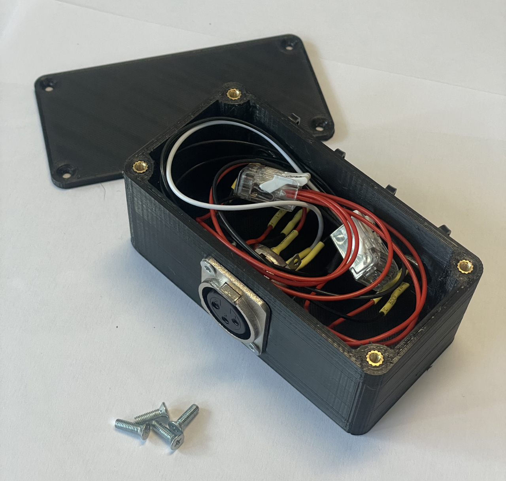
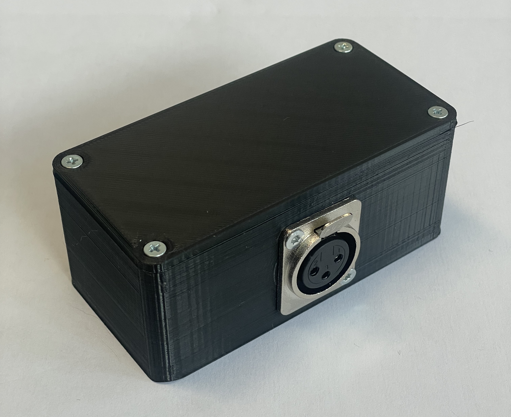
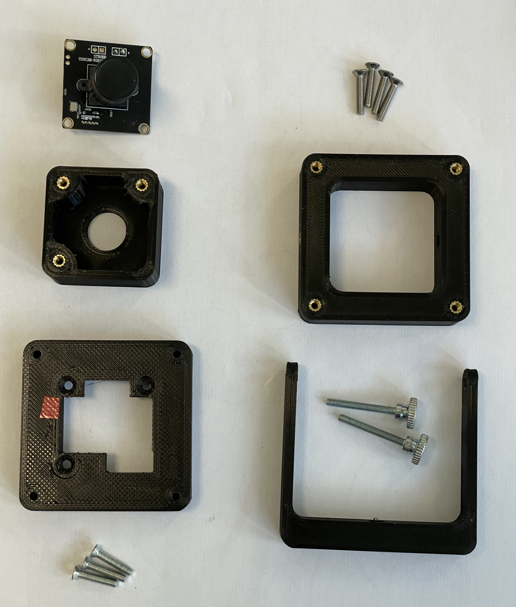
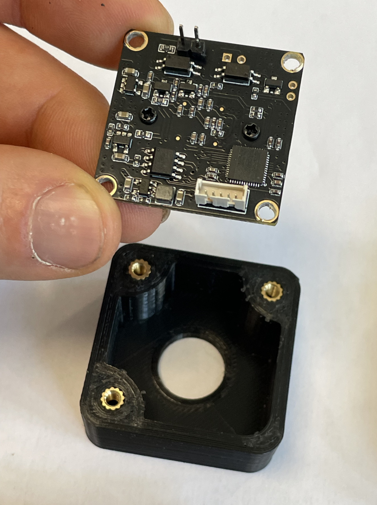
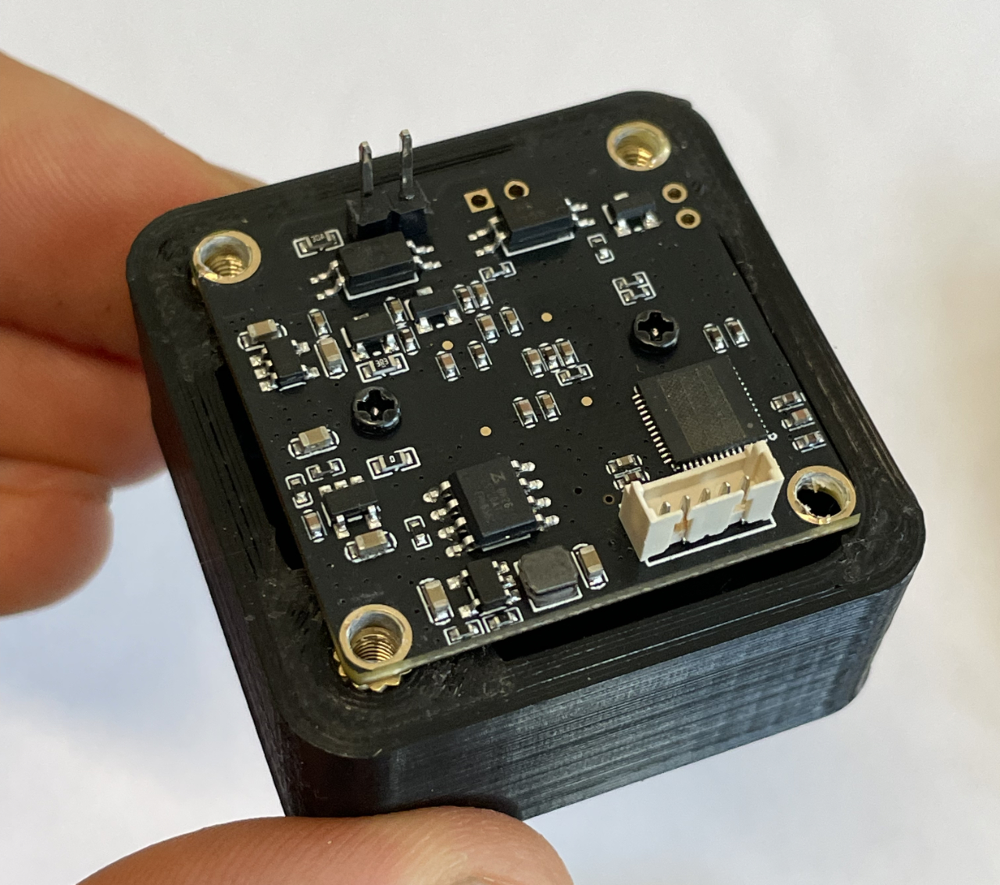
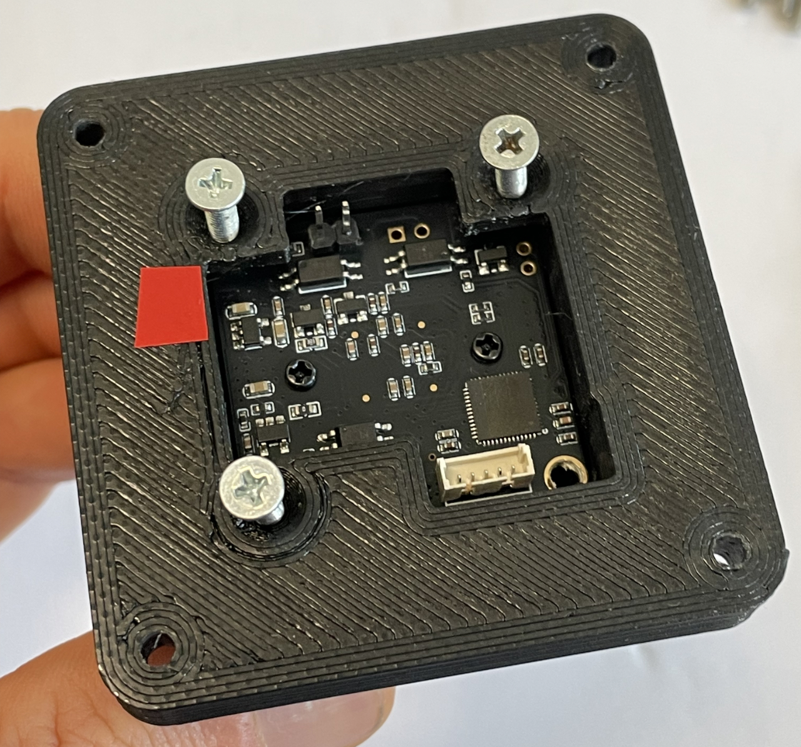
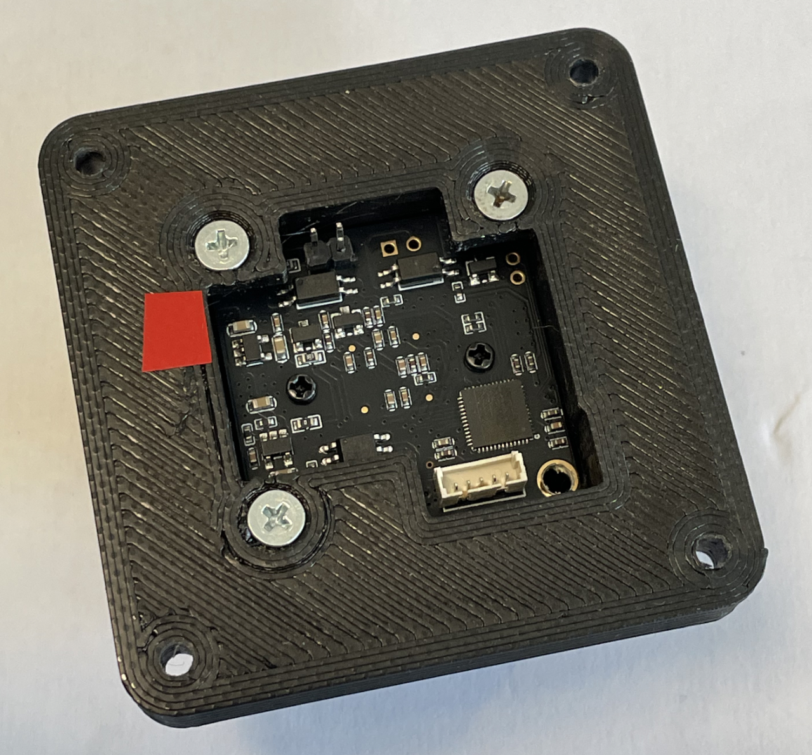
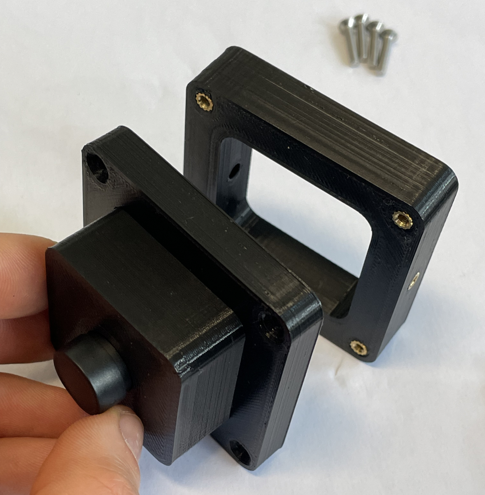
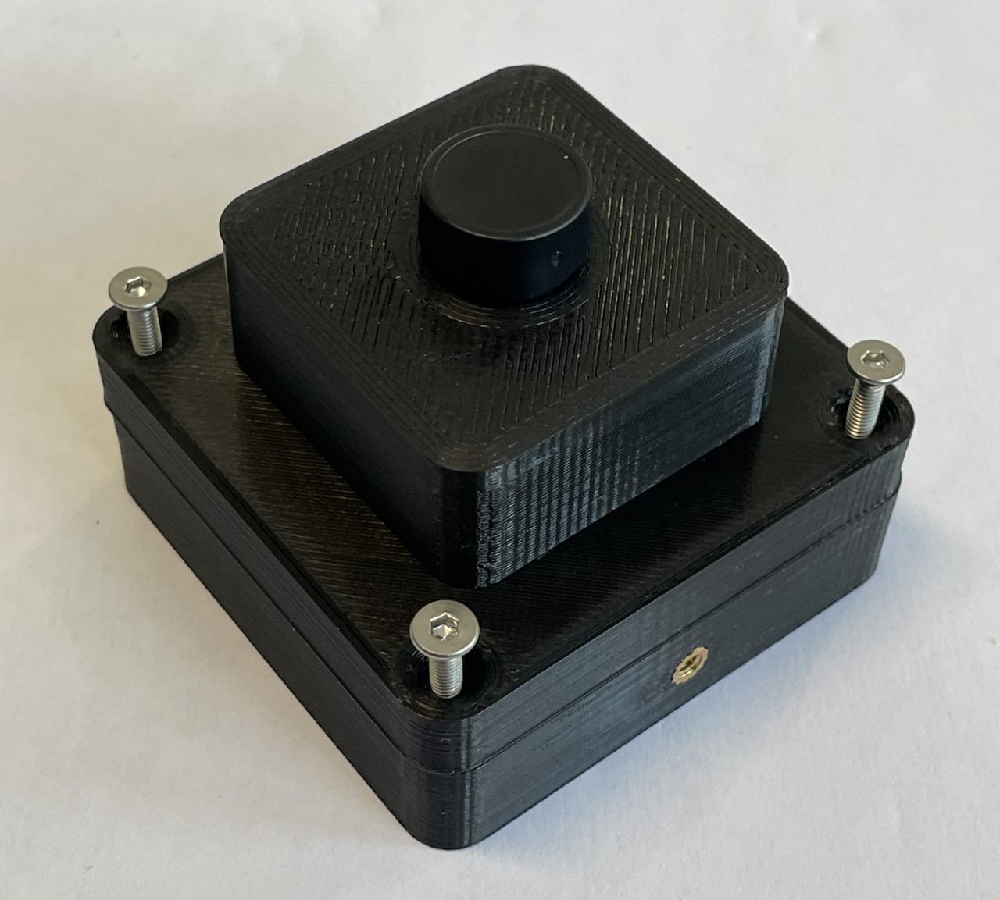
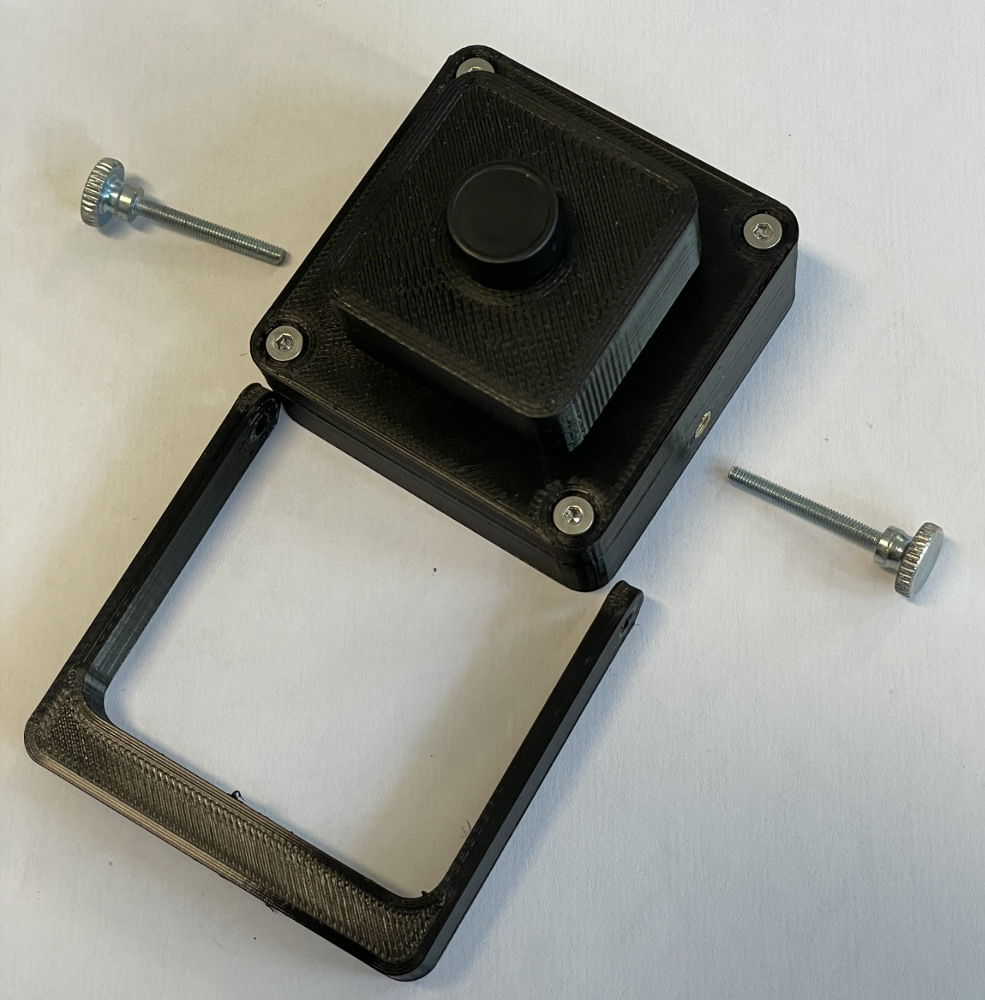

# 3D Printing & Enclosure Assembly Guide (V1 Prototype)

This directory contains CAD source files (FreeCAD `.FCStd`), 3D-printable STL files (`.stl`), render previews, and real-world step-by-step assembly photos for the MoCapSTR hardware components.

---

## Quick Navigation

- [Hardware Bill of Materials (BOM)](#hardware-bill-of-materials-bom)
- [CAD & STL Components Overview](#cad--stl-components-overview)
- [Step-by-Step Assembly Guide](#step-by-step-assembly-guide)
  - [1. Arduino Trigger Box](#1-arduino-trigger-box-assembly)
  - [2. XLR Splitter Box](#2-xlr-splitter-box-assembly)
  - [3. Innomaker OV9281 Camera Enclosure](#3-innomaker-ov9281-camera-enclosure-assembly)
- [Print Recommendations & Technical Notes](#print-recommendations--technical-notes)
- [Deutsche Version (Hier klicken)](#deutsche-version)

---

## Hardware Bill of Materials (BOM)

| Subassembly | 3D Printed Parts | Electronics & Hardware | Fasteners & Inserts |
| :--- | :--- | :--- | :--- |
| **OV9281 Camera Enclosure** *(per camera)* | - 1x `Cam-FRONT` - 1x `Cam-MID` - 1x `Cam-BACK-SHORT` *(or LONG)* - 1x `Cam-BRACKET` | - 1x Innomaker OV9281 USB camera PCB + lens | - **9x** M3 brass heat-set inserts - **7x** M3 15mm screws (3x Front/Mid, 4x Mid/Back) - **2x** M3 thumbscrews (10–25mm) or standard M3 screws for bracket |
| **Arduino Trigger Box** | - 1x `Trigger_Case-BASE` - 1x `Trigger_Case-LID` | - 1x Arduino Nano - 1x Terminal Block Shield Adapter - 1x Neutrik XLR Chassis (Male, D-Series) - 1x 12mm Push-Button (NO) - *(Optional)* 1x DC Barrel Jack (8mm) | - **8x** M3 brass heat-set inserts - **8x** M3 10mm screws (4x Lid, 2x XLR, 2x Shield) |
| **XLR Splitter Box** | - 1x `Splitter_Case-BASE` - 1x `Splitter_Case-LID` | - 1x Neutrik XLR Chassis (Female, D-Series) - 4x DC Barrel Jacks (8mm) - 2x 5-pin Cage Clamp Terminals (WAGO) | - **6x** M3 brass heat-set inserts - **6x** M3 10mm screws (4x Lid, 2x XLR) |

---

## CAD & STL Components Overview

### 1. Arduino Trigger Box (`Trigger_Case`)

| Component / File | Preview | Description |
| :--- | :---: | :--- |
| **Complete Assembly** [`v1_prototype/Trigger_Case.FCStd`](v1_prototype/Trigger_Case.FCStd) |  | Full assembly CAD project. Push-button mount is in the top lid. |
| **Base Enclosure** [`v1_prototype/Trigger_Case-BASE.stl`](v1_prototype/Trigger_Case-BASE.stl) |  | Houses the Arduino Nano with Terminal Block shield, male XLR connector, and optional DC jack. |
| **Top Lid** [`v1_prototype/Trigger_Case-LID.stl`](v1_prototype/Trigger_Case-LID.stl) | *(See complete assembly)* | Top lid with **12mm mounting hole for the Start/Stop trigger push-button**. |

---

### 2. XLR Splitter Box (`Splitter_Case`)

| Component / File | Preview 1 | Preview 2 | Description |
| :--- | :---: | :---: | :--- |
| **Complete Assembly** [`v1_prototype/Splitter_Case.FCStd`](v1_prototype/Splitter_Case.FCStd) [`v1_prototype/Splitter_Case-BASE.stl`](v1_prototype/Splitter_Case-BASE.stl) [`v1_prototype/Splitter_Case-LID.stl`](v1_prototype/Splitter_Case-LID.stl) |  |  | Distributor box with mount for 1x female Neutrik XLR D-series socket and **4x mounting holes for DC barrel jacks** (8mm). |

---

### 3. OV9281 Camera Enclosure (`OV9281_Case`)

  
   
  <em>Complete OV9281 Modular Enclosure Assembly</em>

| Part | File | Preview | Description |
| :--- | :--- | :---: | :--- |
| **Front Bezel** | [`v1_prototype/OV9281_Case_Cam-FRONT.stl`](v1_prototype/OV9281_Case_Cam-FRONT.stl) |  | Front bezel surrounding the M12/CS lens mount (holds 3x heat-set inserts). |
| **Middle Frame** | [`v1_prototype/OV9281_Case_Cam-MID.stl`](v1_prototype/OV9281_Case_Cam-MID.stl) |  | **PCB Backing Frame:** Sandwiches and locks the camera PCB against the front bezel with 3x M3 15mm screws. |
| **Back Cover (Short)** | [`v1_prototype/OV9281_Case_Cam-BACK-SHORT.stl`](v1_prototype/OV9281_Case_Cam-BACK-SHORT.stl) |  | **Open back design:** Direct access to plug cables straight onto the camera pin headers. |
| **Back Cover (Long)** | [`v1_prototype/OV9281_Case_Cam-BACK-LONG.stl`](v1_prototype/OV9281_Case_Cam-BACK-LONG.stl) |  | **Fully enclosed design:** Extended enclosure with a rear hole for a **cable strain relief** and cutout for a **speaker spring terminal clip**. |
| **Mounting Bracket** | [`v1_prototype/OV9281_Case_Cam-BRACKET.stl`](v1_prototype/OV9281_Case_Cam-BRACKET.stl) |  | Tripod / rig bracket with a pilot hole for tapping a **1/4"-20 UNC standard tripod thread**. |

---

## Step-by-Step Assembly Guide

### 1. Arduino Trigger Box Assembly

  
  &nbsp;&nbsp;&nbsp;&nbsp;
  

1. **Threaded Inserts:** Melt 8x M3 heat-set inserts into the base (4 for lid corners, 2 for XLR chassis, 2 for Arduino shield mount).
2. **Mount Hardware:** Screw in the male Neutrik XLR connector and secure the Arduino Terminal Shield into the base.
3. **Internal Wiring:**
   - Connect **XLR Pin 1** (Ground/Shield) to Arduino **GND**.
   - Connect **XLR Pin 2** (Signal Hot) to Arduino **Pin 2**.
   - Bridge **XLR Pin 3** with **XLR Pin 1** (GND).
4. **Push-Button:** Mount the 12mm push button into the lid. Connect its two wires between Arduino **Pin 4** and Arduino **GND** (utilizes internal `INPUT_PULLUP`). A small 2-pin clamp or connector makes closing the lid convenient.
5. **Close Enclosure:** Fasten the lid with 4x M3 10mm screws.

---

### 2. XLR Splitter Box Assembly

  
  &nbsp;&nbsp;&nbsp;&nbsp;
  

  
  &nbsp;&nbsp;&nbsp;&nbsp;
  

1. **Threaded Inserts:** Melt 6x M3 heat-set inserts into the base (4 for lid corners, 2 for XLR chassis).
2. **Mount Sockets:** Screw the female Neutrik XLR chassis socket into the front, and install the 4x DC barrel jacks into the rear holes.
3. **Wiring with Cage Clamp Terminals (WAGO):**
   - **Signal (Hot):** Run a wire from **XLR Pin 2** into the first 5-pin clamp. Connect the 4 positive/center leads of the DC barrel jacks to this clamp.
   - **Ground & Shield (GND):** Run a wire from **XLR Pin 1** into the second 5-pin clamp. Connect all 4 ground/outer leads of the DC barrel jacks to this clamp.
   - *(XLR Pin 3 can be bridged to Pin 1 or left open).*
4. **Close Enclosure:** Tuck the wires neatly into the case and secure the lid with 4x M3 10mm screws.

---

### 3. Innomaker OV9281 Camera Enclosure Assembly

#### Step 1: Parts Preparation & Heat-Set Inserts

  

- Melt **3x M3 inserts** into the inner pillars of `Cam-FRONT`.
- Melt **4x M3 inserts** into the 4 corners of `Cam-MID`.
- Melt **2x M3 inserts** into the side mounting holes of `Cam-BACK-SHORT` (for the bracket).
- Tap the center hole of `Cam-BRACKET` with a **1/4"-20 UNC hand tap** for tripod mounting.

---

#### Step 2: Place Camera PCB into Front Bezel

  
  &nbsp;&nbsp;&nbsp;&nbsp;
  

- Insert the OV9281 PCB with the lens facing through the front opening.
- Ensure the trigger header (FSIN pins) and USB connector line up with the orientation cutouts.

---

#### Step 3: Fasten Middle Frame (PCB Sandwich)

  
  &nbsp;&nbsp;&nbsp;&nbsp;
  

- Place `Cam-MID` over the back of the camera PCB.
- Insert and tighten **3x M3 15mm countersunk screws** into the brass inserts of `Cam-FRONT`. The camera PCB is now solidly clamped and locked in place.

---

#### Step 4: Attach Back Cover

  
  &nbsp;&nbsp;&nbsp;&nbsp;
  

- Align `Cam-BACK-SHORT` (or `Cam-BACK-LONG`) with the middle frame.
- Secure it with **4x M3 15mm screws** threading into the 4 brass inserts of `Cam-MID`.

---

#### Step 5: Mount Bracket

  

- Attach `Cam-BRACKET` over the sides of the camera enclosure.
- Fasten using **2x M3 thumbscrews (10–25mm length)** into the side brass inserts.

---

## Print Recommendations & Technical Notes

### Material & Slicer Settings
- **Material:** PLA or PETG (PLA is tested and works reliably).
- **Infill:** ~20% – 25% (walls are structurally thin and sturdy).
- **Layer Height:** 0.16 mm – 0.20 mm recommended.
- **Supports:** Generally minimal; align parts flat on the print bed.

### Dimensional Tolerances
- All CAD models have been designed with **slightly generous clearances** so parts assemble cleanly even on 3D printers that slightly over-extrude.
- On well-calibrated/high-precision printers, the fit will be comfortable and slightly relaxed.

### Threaded Inserts vs. Self-Tapping Screws
- **M3 Heat-Set Inserts (Einschmelzgewinde):** The mounting holes are designed for standard M3 brass heat-set inserts (melted in with a soldering iron).
- **Alternative for Older/Looser Printers:** If you do not have threaded inserts, you can either use small self-tapping / wood screws directly into the plastic or reduce the hole diameter in the provided FreeCAD `.FCStd` source files before slicing.

---
---

# Deutsche Version

Dieses Verzeichnis enthält die CAD-Konstruktionsdateien (FreeCAD `.FCStd`), 3D-druckbare STL-Dateien (`.stl`), Render-Vorschauen sowie reale Schritt-für-Schritt-Montagefotos für die MoCapSTR Hardware-Komponenten.

---

## Schnellnavigation

- [Hardware-Stückliste (BOM)](#hardware-stückliste-bom)
- [CAD- & STL-Komponenten Übersicht](#cad--stl-komponenten-übersicht)
- [Schritt-für-Schritt Montageanleitung](#schritt-für-schritt-montageanleitung)
  - [1. Arduino Trigger-Gehäuse](#1-montage-arduino-trigger-gehäuse)
  - [2. XLR Splitter-Box](#2-montage-xlr-splitter-box)
  - [3. Innomaker OV9281 Kamera-Gehäuse](#3-montage-innomaker-ov9281-kamera-gehäuse)
- [Druckempfehlungen & Technische Hinweise](#druckempfehlungen--technische-hinweise)

---

## Hardware-Stückliste (BOM)

| Baugruppe | 3D-Druckteile | Elektronik & Komponenten | Schrauben & Inserts |
| :--- | :--- | :--- | :--- |
| **OV9281 Kamera-Gehäuse** *(pro Kamera)* | - 1x `Cam-FRONT` - 1x `Cam-MID` - 1x `Cam-BACK-SHORT` *(oder LONG)* - 1x `Cam-BRACKET` | - 1x Innomaker OV9281 USB-Kamera inkl. Objektiv | - **9x** M3 Einschmelzgewinde - **7x** M3 15mm Schrauben (3x Front/Mid, 4x Mid/Back) - **2x** M3 Rändelschrauben (10–25mm) oder M3 Schrauben für den Bügel |
| **Arduino Trigger-Gehäuse** | - 1x `Trigger_Case-BASE` - 1x `Trigger_Case-LID` | - 1x Arduino Nano - 1x Terminal Block Shield Adapter - 1x Neutrik XLR Einbaubuchse (Männlich, D-Serie) - 1x 12mm Taster (Schließer) - *(Optional)* 1x DC Hohlbuchse (8mm) | - **8x** M3 Einschmelzgewinde - **8x** M3 10mm Schrauben (4x Deckel, 2x XLR, 2x Shield) |
| **XLR Splitter-Box** | - 1x `Splitter_Case-BASE` - 1x `Splitter_Case-LID` | - 1x Neutrik XLR Einbaubuchse (Weiblich, D-Serie) - 4x DC Hohlbuchsen (8mm) - 2x 5-polige Käfigzugklemmen (WAGO) | - **6x** M3 Einschmelzgewinde - **6x** M3 10mm Schrauben (4x Deckel, 2x XLR) |

---

## CAD- & STL-Komponenten Übersicht

### 1. Arduino Trigger-Gehäuse (`Trigger_Case`)

| Bauteil / Datei | Vorschau | Beschreibung |
| :--- | :---: | :--- |
| **Gesamt-Baugruppe** [`v1_prototype/Trigger_Case.FCStd`](v1_prototype/Trigger_Case.FCStd) |  | Vollständiges CAD-Projekt in FreeCAD. Die Tasteraufnahme befindet sich im Deckel. |
| **Gehäuseunterteil** [`v1_prototype/Trigger_Case-BASE.stl`](v1_prototype/Trigger_Case-BASE.stl) |  | Nimmt Arduino-Shield, XLR-Einbaubuchse und optionale DC-Hohlbuchse auf. |
| **Deckel** [`v1_prototype/Trigger_Case-LID.stl`](v1_prototype/Trigger_Case-LID.stl) | *(Siehe Gesamtansicht)* | Gehäusedeckel mit **12mm-Montageloch für den Start/Stop-Taster (Trigger-Button)**. |

---

### 2. XLR Splitter-Box (`Splitter_Case`)

| Bauteil / Datei | Ansicht 1 | Ansicht 2 | Beschreibung |
| :--- | :---: | :---: | :--- |
| **Gesamt-Baugruppe** [`v1_prototype/Splitter_Case.FCStd`](v1_prototype/Splitter_Case.FCStd) [`v1_prototype/Splitter_Case-BASE.stl`](v1_prototype/Splitter_Case-BASE.stl) [`v1_prototype/Splitter_Case-LID.stl`](v1_prototype/Splitter_Case-LID.stl) |  |  | Verteilergehäuse mit Aufnahme für 1x Neutrik XLR-D Buchse (Weiblich) und **4 Bohrungen für DC-Hohlbuchsen** (8mm). |

---

### 3. OV9281 Kamera-Gehäuse (`OV9281_Case`)

  
   
  <em>Zusammenbau des modularen OV9281 Gehäuses</em>

| Teil | Datei | Vorschau | Beschreibung |
| :--- | :--- | :---: | :--- |
| **Frontblende** | [`v1_prototype/OV9281_Case_Cam-FRONT.stl`](v1_prototype/OV9281_Case_Cam-FRONT.stl) |  | Frontabdeckung rund um den M12/CS Objektivhalter (enthält 3 Einschmelzgewinde). |
| **Mittelteil** | [`v1_prototype/OV9281_Case_Cam-MID.stl`](v1_prototype/OV9281_Case_Cam-MID.stl) |  | **Platinen-Rückträger:** Klemmt die Kameraplatine mit 3x M3 15mm Schrauben fest an die Frontblende. |
| **Rückteil (Kurz / Short)** | [`v1_prototype/OV9281_Case_Cam-BACK-SHORT.stl`](v1_prototype/OV9281_Case_Cam-BACK-SHORT.stl) |  | **Offene Variante:** Direkter Zugriff auf die Stiftleisten (Header) der Kameraplatine. |
| **Rückteil (Lang / Long)** | [`v1_prototype/OV9281_Case_Cam-BACK-LONG.stl`](v1_prototype/OV9281_Case_Cam-BACK-LONG.stl) |  | **Geschlossene Variante:** Längeres Gehäuse mit Loch für eine **Zugentlastung** und Aufnahme für ein **Lautsprecher-Klemmenterminal**. |
| **Halterung / Bracket** | [`v1_prototype/OV9281_Case_Cam-BRACKET.stl`](v1_prototype/OV9281_Case_Cam-BRACKET.stl) |  | Stativ-/Rig-Halterung mit Bohrung zum Schneiden eines **1/4"-20 UNC Standard-Kamerastativgewindes**. |

---

## Schritt-für-Schritt Montageanleitung

### 1. Montage Arduino Trigger-Gehäuse

  
  &nbsp;&nbsp;&nbsp;&nbsp;
  

1. **Einschmelzgewinde:** 8x M3 Gewindeeinsätze in das Gehäuseunterteil einschmelzen (4 für die Deckelecken, 2 für die XLR-Buchse, 2 für die Arduino-Shield-Befestigung).
2. **Hardware montieren:** Neutrik XLR-Einbaustecker (Männlich) und Arduino Terminal Shield im Gehäuse verschrauben.
3. **Innenverkabelung:**
   - **XLR Pin 1** (Masse/Schirm) mit Arduino **GND** verbinden.
   - **XLR Pin 2** (Signal Hot) mit Arduino **Pin 2** verbinden.
   - **XLR Pin 3** mit **XLR Pin 1** (GND) brücken.
4. **Taster:** 12mm Taster in den Deckel einbauen. Die beiden Adern mit Arduino **Pin 4** und Arduino **GND** verbinden (nutzt die interne `INPUT_PULLUP` Funktion). Eine kleine 2-polige Klemme erleichtert die Trennung beim Öffnen.
5. **Gehäuse schließen:** Deckel mit 4x M3 10mm Schrauben fixieren.

---

### 2. Montage XLR Splitter-Box

  
  &nbsp;&nbsp;&nbsp;&nbsp;
  

  
  &nbsp;&nbsp;&nbsp;&nbsp;
  

1. **Einschmelzgewinde:** 6x M3 Gewindeeinsätze einschmelzen (4 in den Deckelecken, 2 für die XLR-Buchse).
2. **Buchsen einbauen:** Neutrik XLR-D Einbaubuchse (Weiblich) vorne und 4x DC-Hohlbuchsen hinten einschrauben.
3. **Verdrahtung mit Käfigzugklemmen (WAGO):**
   - **Signal (Hot):** Eine Ader von **XLR Pin 2** in die erste 5er-Klemme führen. Die 4 Plus-/Mittelkontakte der DC-Buchsen daran anschließen.
   - **Masse & Schirmung (GND):** Eine Ader von **XLR Pin 1** in die zweite 5er-Klemme führen. Alle 4 Masse-/Außenkontakte der DC-Buchsen daran anschließen.
   - *(XLR Pin 3 mit Pin 1 brücken oder frei lassen).*
4. **Gehäuse schließen:** Kabel sauber im Inneren verstauen und den Deckel mit 4x M3 10mm Schrauben verschrauben.

---

### 3. Montage Innomaker OV9281 Kamera-Gehäuse

#### Schritt 1: Teile-Vorbereitung & Einschmelzgewinde

  

- **3x M3 Gewindeeinsätze** in die inneren Dome von `Cam-FRONT` einschmelzen.
- **4x M3 Gewindeeinsätze** in die 4 Ecken von `Cam-MID` einschmelzen.
- **2x M3 Gewindeeinsätze** in die seitlichen Bohrungen von `Cam-BACK-SHORT` für den Haltebügel einschmelzen.
- Die mittlere Bohrung des `Cam-BRACKET` mit einem **1/4"-20 UNC Gewindeschneider** mit einem Standard-Fotogewinde versehen.

---

#### Schritt 2: Kameraplatine in Frontblende einlegen

  
  &nbsp;&nbsp;&nbsp;&nbsp;
  

- Die OV9281 Platine mit dem Objektiv voran in die Frontblende einsetzen.
- Auf die Ausrichtung der FSIN-Trigger-Pins und der Buchsen achten.

---

#### Schritt 3: Mittelteil montieren (Platinen-Sandwich)

  
  &nbsp;&nbsp;&nbsp;&nbsp;
  

- `Cam-MID` auf die Rückseite der Platine auflegen.
- Mit **3x M3 15mm Senkkopfschrauben** in die Messingeinsätze der Frontblende festziehen. Die Platine ist nun absolut spielfrei fixiert.

---

#### Schritt 4: Rückteil befestigen

  
  &nbsp;&nbsp;&nbsp;&nbsp;
  

- `Cam-BACK-SHORT` (oder `Cam-BACK-LONG`) auf das Mittelteil aufsetzen.
- Mit **4x M3 15mm Schrauben** in die 4 Gewindeeinsätze des Mittelteils verschrauben.

---

#### Schritt 5: Stativbügel montieren

  

- `Cam-BRACKET` über das Gehäuse schieben.
- Mit **2x M3 Rändelschrauben (10–25mm Länge)** in den seitlichen Gewindeeinsätzen befestigen.

---

## Druckempfehlungen & Technische Hinweise

### Material & Slicer-Einstellungen
- **Material:** PLA oder PETG (PLA ist formstabil und getestet).
- **Infill:** ca. 20% – 25% (Wandstärken bieten ausreichend Stabilität).
- **Schichthöhe (Layer Height):** 0.16 mm – 0.20 mm empfohlen.
- **Stützstrukturen (Supports):** Kaum notwendig; Teile flach auf dem Druckbett ausrichten.

### Passungen & Toleranzen
- Alle CAD-Modelle sind mit **leicht großzügigen Toleranzen** konstruiert, damit alles auch bei leichter Überextrusion ohne Schleifen zusammenpasst.
- Bei hochpräzisen Druckern sitzen die Teile angenehm locker und spannungsfrei.

### Einschmelzgewinde vs. Direktverschraubung
- **M3 Einschmelzgewinde (Heat-Set Inserts):** Alle Schraubpunkte sind für M3-Messing-Gewindeeinsätze ausgelegt.
- **Alternative:** Kleine Holz-/Blechschrauben direkt in den Kunststoff eindrehen oder Bohrungen in FreeCAD verkleinern.
