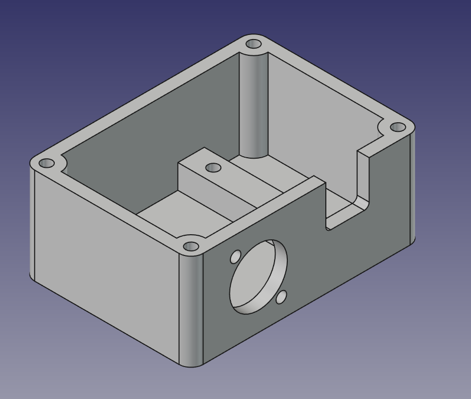
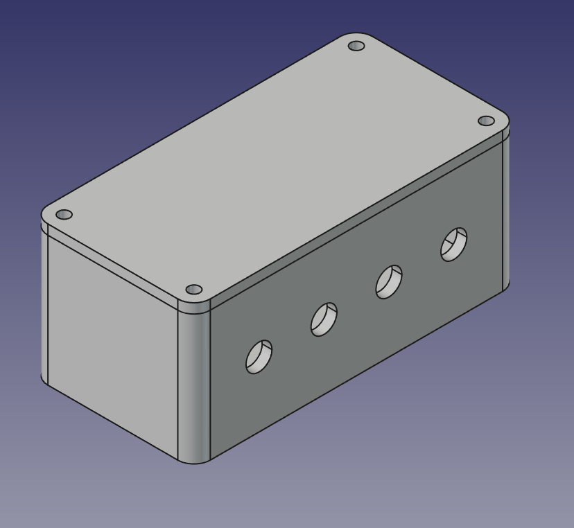
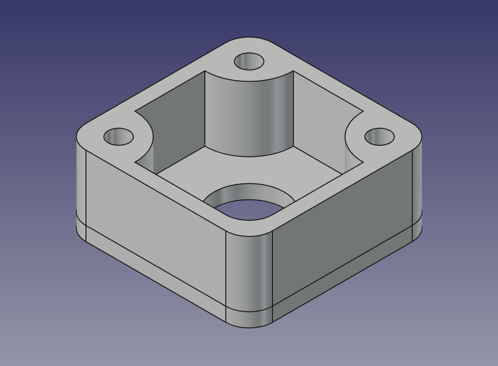
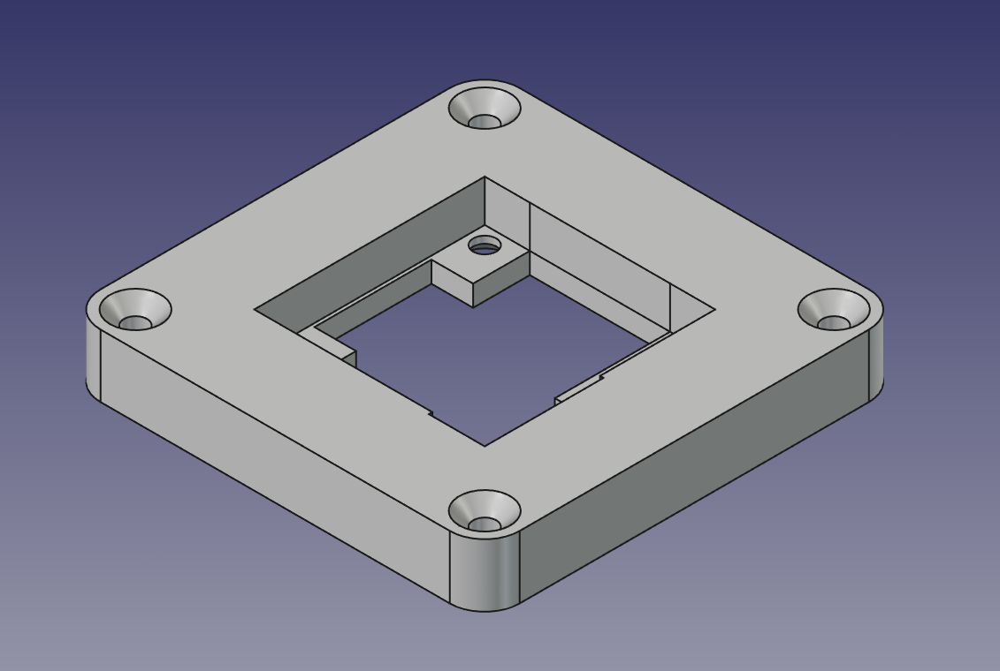
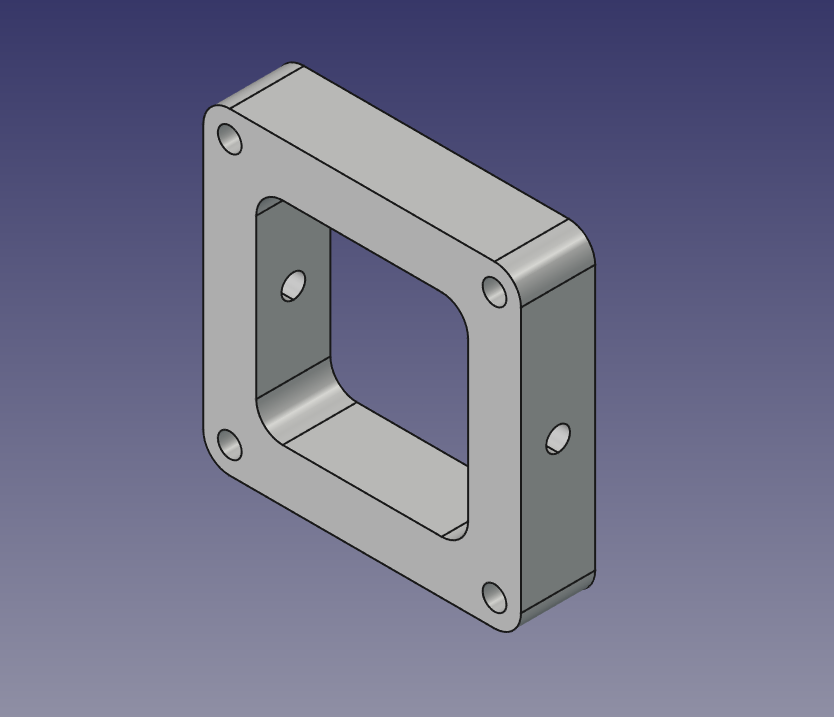
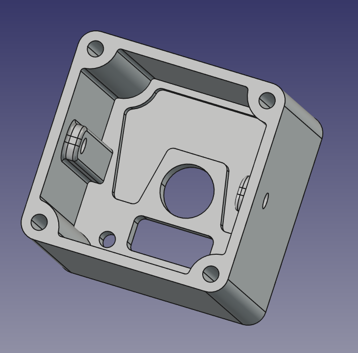
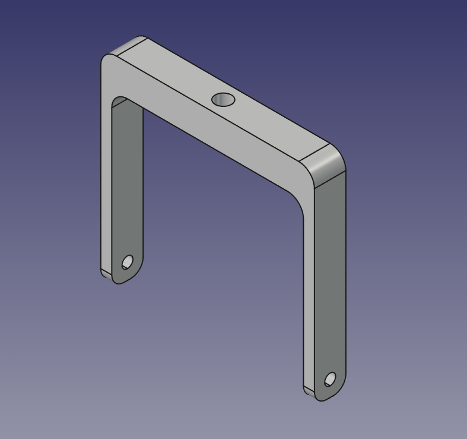

# 3D Printing & Enclosure Guide (V1 Prototype)

This directory contains CAD files (FreeCAD `.FCStd`), 3D-printable STL files (`.stl`), and render previews for the MoCapSTR hardware components.

---

## Quick Navigation

- [1. Arduino Trigger Box (`Trigger_Case`)](#1-arduino-trigger-box-trigger_case)
- [2. XLR Splitter Box (`Splitter_Case`)](#2-xlr-splitter-box-splitter_case)
- [3. OV9281 Camera Enclosure (`OV9281_Case`)](#3-ov9281-camera-enclosure-ov9281_case)
- [Print Recommendations & Assembly Notes](#print-recommendations--assembly-notes)
- [Deutsche Version (Hier klicken)](#deutsche-version)

---

## Component Overview

### 1. Arduino Trigger Box (`Trigger_Case`)

Enclosure for the Arduino (e.g. Nano with Terminal Block Shield), male Neutrik XLR D-series chassis connector, 12mm push-button, and optional 8mm DC barrel jack.

| Component / File | Preview | Description |
| :--- | :---: | :--- |
| **Complete Assembly** [`v1_prototype/Trigger_Case.FCStd`](v1_prototype/Trigger_Case.FCStd) |  | Full assembly CAD project. |
| **Base Enclosure** [`v1_prototype/Trigger_Case-BASE.stl`](v1_prototype/Trigger_Case-BASE.stl) |  | Holds the Arduino Nano shield, XLR jack, and push button. |
| **Top Lid** [`v1_prototype/Trigger_Case-LID.stl`](v1_prototype/Trigger_Case-LID.stl) | *(See complete assembly)* | Snap-on / screw-down top cover. |

---

### 2. XLR Splitter Box (`Splitter_Case`)

Central on-set distributor box. Houses the female Neutrik XLR D-series input and outputs four shielded cables to the cameras.

| Component / File | Preview 1 | Preview 2 | Description |
| :--- | :---: | :---: | :--- |
| **Complete Assembly** [`v1_prototype/Splitter_Case.FCStd`](v1_prototype/Splitter_Case.FCStd) [`v1_prototype/Splitter_Case-BASE.stl`](v1_prototype/Splitter_Case-BASE.stl) [`v1_prototype/Splitter_Case-LID.stl`](v1_prototype/Splitter_Case-LID.stl) |  |  | Enclosure with strain-relief channels for four camera cables and mount for 1x XLR female D-size socket. |

---

### 3. OV9281 Camera Enclosure (`OV9281_Case`)

Modular multi-part case for the Innomaker OV9281 USB global-shutter camera board and lens mount.

  
   
  <em>Complete OV9281 Modular Enclosure Assembly</em>

| Part | File | Preview | Description |
| :--- | :--- | :---: | :--- |
| **Front Bezel** | [`v1_prototype/OV9281_Case_Cam-FRONT.stl`](v1_prototype/OV9281_Case_Cam-FRONT.stl) |  | Front bezel surrounding the M12/CS lens mount. |
| **Middle Frame** | [`v1_prototype/OV9281_Case_Cam-MID.stl`](v1_prototype/OV9281_Case_Cam-MID.stl) |  | Secures the camera PCB and connects front to back. |
| **Back Cover (Short)** | [`v1_prototype/OV9281_Case_Cam-BACK-SHORT.stl`](v1_prototype/OV9281_Case_Cam-BACK-SHORT.stl) |  | **Open back design:** Direct and easy access to plug cables straight onto the camera board pin headers. |
| **Back Cover (Long)** | [`v1_prototype/OV9281_Case_Cam-BACK-LONG.stl`](v1_prototype/OV9281_Case_Cam-BACK-LONG.stl) |  | **Fully enclosed design:** Extended enclosure protecting the internal wiring with rear exit cutouts. |
| **Mounting Bracket** | [`v1_prototype/OV9281_Case_Cam-BRACKET.stl`](v1_prototype/OV9281_Case_Cam-BRACKET.stl) |  | Tripod / rig mounting bracket. Features a pilot hole for tapping a **1/4"-20 UNC standard tripod thread**. |
| **CAD Source** | [`v1_prototype/OV9281_Case.FCStd`](v1_prototype/OV9281_Case.FCStd) | — | FreeCAD source model. |

---

## Print Recommendations & Assembly Notes

### Material & Slicer Settings
- **Material:** PLA or PETG (PLA is tested and works reliably).
- **Infill:** ~20% – 25% (walls are structurally thin and sturdy).
- **Layer Height:** 0.16 mm – 0.20 mm recommended.
- **Supports:** Generally minimal; check orientation so bracket screw holes and overhangs face bed appropriately.

### Dimensional Tolerances
- All CAD models have been designed with **slightly generous clearances** so parts assemble cleanly even on 3D printers that slightly over-extrude.
- On well-calibrated/high-precision printers, the fit will be comfortable and slightly relaxed.

### Threaded Inserts vs. Self-Tapping Screws
- **M3 Heat-Set Inserts (Einschmelzgewinde):** The mounting holes for the Neutrik XLR chassis connectors and case corners are designed for M3 brass heat-set inserts (melted in with a soldering iron).
- **Alternative for Older/Looser Printers:** If you do not have threaded inserts or your printer prints looser tolerances, you can either:
  1. Use small self-tapping screws / wood screws directly into the plastic.
  2. Reduce the hole diameter in the provided FreeCAD `.FCStd` source files before slicing.

### Camera Tripod Thread (`Cam-BRACKET`)
- The bracket contains a pre-sized pilot hole designed to be tapped with a **1/4"-20 UNC hand tap** (standard camera tripod thread size).

---
---

# Deutsche Version

Dieses Verzeichnis enthält die CAD-Konstruktionsdateien (FreeCAD `.FCStd`), 3D-druckbare STL-Dateien (`.stl`) sowie Render-Vorschauen für die MoCapSTR Hardware-Komponenten.

---

## Schnellnavigation

- [1. Arduino Trigger-Gehäuse (`Trigger_Case`)](#1-arduino-trigger-gehäuse-trigger_case)
- [2. XLR Splitter-Box (`Splitter_Case`)](#2-xlr-splitter-box-splitter_case)
- [3. OV9281 Kamera-Gehäuse (`OV9281_Case`)](#3-ov9281-kamera-gehäuse-ov9281_case)
- [Druckempfehlungen & Montagehinweise](#druckempfehlungen--montagehinweise)

---

## Komponenten-Übersicht

### 1. Arduino Trigger-Gehäuse (`Trigger_Case`)

Gehäuse für den Arduino (z. B. Nano mit Terminal Block Shield), Neutrik XLR-D-Einbaustecker (Männlich), 12mm Taster und optionale 8mm DC-Hohlbuchse.

| Bauteil / Datei | Vorschau | Beschreibung |
| :--- | :---: | :--- |
| **Gesamt-Baugruppe** [`v1_prototype/Trigger_Case.FCStd`](v1_prototype/Trigger_Case.FCStd) |  | Vollständiges CAD-Projekt in FreeCAD. |
| **Gehäuseunterteil** [`v1_prototype/Trigger_Case-BASE.stl`](v1_prototype/Trigger_Case-BASE.stl) |  | Nimmt Arduino-Shield, XLR-Buchse und Taster auf. |
| **Deckel** [`v1_prototype/Trigger_Case-LID.stl`](v1_prototype/Trigger_Case-LID.stl) | *(Siehe Gesamtansicht)* | Gehäusedeckel zum Verschrauben / Aufsetzen. |

---

### 2. XLR Splitter-Box (`Splitter_Case`)

Zentrale Verteilerbox am Set. Beherbergt die Neutrik XLR-D Einbaubuchse (Weiblich) als Eingang und führt vier geschirmte Kabel zu den Kameras ab.

| Bauteil / Datei | Ansicht 1 | Ansicht 2 | Beschreibung |
| :--- | :---: | :---: | :--- |
| **Gesamt-Baugruppe** [`v1_prototype/Splitter_Case.FCStd`](v1_prototype/Splitter_Case.FCStd) [`v1_prototype/Splitter_Case-BASE.stl`](v1_prototype/Splitter_Case-BASE.stl) [`v1_prototype/Splitter_Case-LID.stl`](v1_prototype/Splitter_Case-LID.stl) |  |  | Gehäuse mit integrierten Zugentlastungskanälen für 4 Kamerakabel und Aufnahme für die Neutrik XLR-D Buchse. |

---

### 3. OV9281 Kamera-Gehäuse (`OV9281_Case`)

Modulares Mehrkomponenten-Gehäuse für die Innomaker OV9281 USB Global-Shutter Kamera und Objektivfassung.

  
   
  <em>Zusammenbau des modularen OV9281 Gehäuses</em>

| Teil | Datei | Vorschau | Beschreibung |
| :--- | :--- | :---: | :--- |
| **Frontblende** | [`v1_prototype/OV9281_Case_Cam-FRONT.stl`](v1_prototype/OV9281_Case_Cam-FRONT.stl) |  | Frontabdeckung rund um den M12/CS Objektivhalter. |
| **Mittelteil** | [`v1_prototype/OV9281_Case_Cam-MID.stl`](v1_prototype/OV9281_Case_Cam-MID.stl) |  | Hält die Kameraplatine und verbindet Front und Rückseite. |
| **Rückteil (Kurz / Short)** | [`v1_prototype/OV9281_Case_Cam-BACK-SHORT.stl`](v1_prototype/OV9281_Case_Cam-BACK-SHORT.stl) |  | **Offene Variante:** Direkter Zugriff, um Kabel direkt auf die Steckleisten (Header) der Kameraplatine zu stecken. |
| **Rückteil (Lang / Long)** | [`v1_prototype/OV9281_Case_Cam-BACK-LONG.stl`](v1_prototype/OV9281_Case_Cam-BACK-LONG.stl) |  | **Geschlossene Variante:** Längeres, geschlossenes Gehäuse mit geschützter interner Kabelführung und rückseitigen Auslässen. |
| **Halterung / Bracket** | [`v1_prototype/OV9281_Case_Cam-BRACKET.stl`](v1_prototype/OV9281_Case_Cam-BRACKET.stl) |  | Stativ-/Rig-Halterung. Besitzt ein Vorbohrloch zum Nachschneiden eines **1/4"-20 UNC Standard-Kamerastativgewindes**. |
| **CAD-Projekt** | [`v1_prototype/OV9281_Case.FCStd`](v1_prototype/OV9281_Case.FCStd) | — | FreeCAD Quelldatei. |

---

## Druckempfehlungen & Montagehinweise

### Material & Slicer-Einstellungen
- **Material:** PLA oder PETG (PLA funktioniert problemlos und formstabil).
- **Infill:** ca. 20% – 25% (die Wandstärken sind passend dimensioniert).
- **Schichthöhe (Layer Height):** 0.16 mm – 0.20 mm empfohlen.
- **Stützstrukturen (Supports):** Größtenteils nicht zwingend notwendig; Teile flach auf dem Druckbett ausrichten.

### Passungen & Toleranzen
- Alle Modelle sind konstruktiv mit **etwas großzügigeren Toleranzen und Bohrungsdurchmessern** ausgelegt, damit die Teile auch bei Druckern mit leichter Überextrusion ohne Nachfeilen passen.
- Bei sehr präzisen / modernen 3D-Druckern sitzen die Teile dadurch angenehm leicht und locker.

### Einschmelzgewinde vs. Direktverschraubung
- **M3 Einschmelzgewinde (Heat-Set Inserts):** Die Bohrungen für die Neutrik XLR-Einbaubuchsen und Gehäuseecken sind für M3-Messing-Gewindeeinsätze vorgesehen, die mit der Lötspitze warm in den Kunststoff gedrückt werden.
- **Alternative für ältere/ungenauere Drucker oder ohne Inserts:**
  1. Es können stattdessen kleine selbstschneidende Schrauben / Holzschrauben direkt in das Plastik geschraubt werden.
  2. Die Bohrungsdurchmesser können bei Bedarf direkt in den beiliegenden FreeCAD `.FCStd` Dateien angepasst werden.

### 1/4" Stativgewinde (`Cam-BRACKET`)
- Das Befestigungsloch im Bügel ist so dimensioniert, dass man direkt mit einem **1/4"-20 UNC Gewindeschneider** (Standard-Fotogewinde) ein sauberes Stativgewinde hineinschneiden kann.
