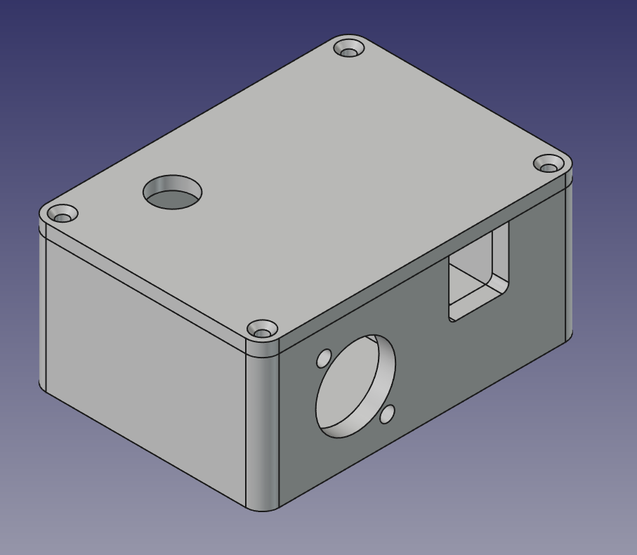
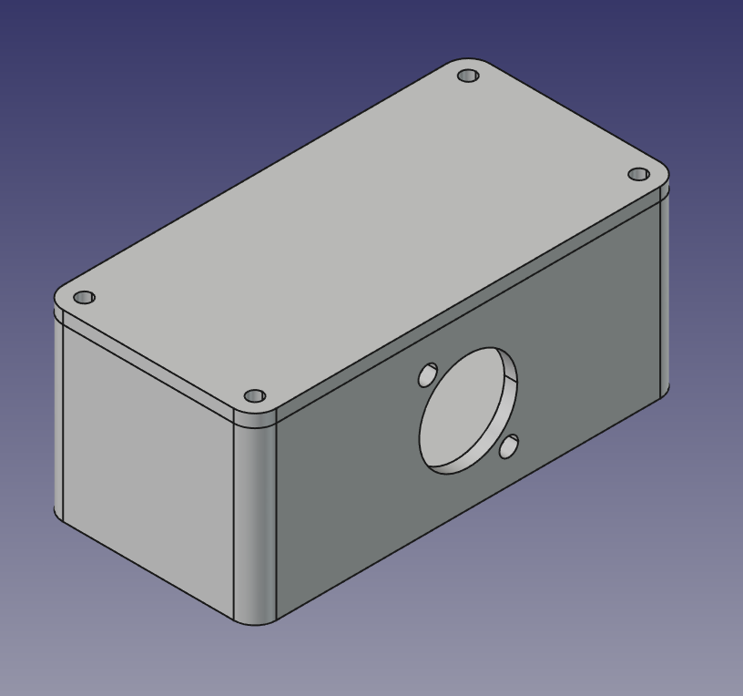
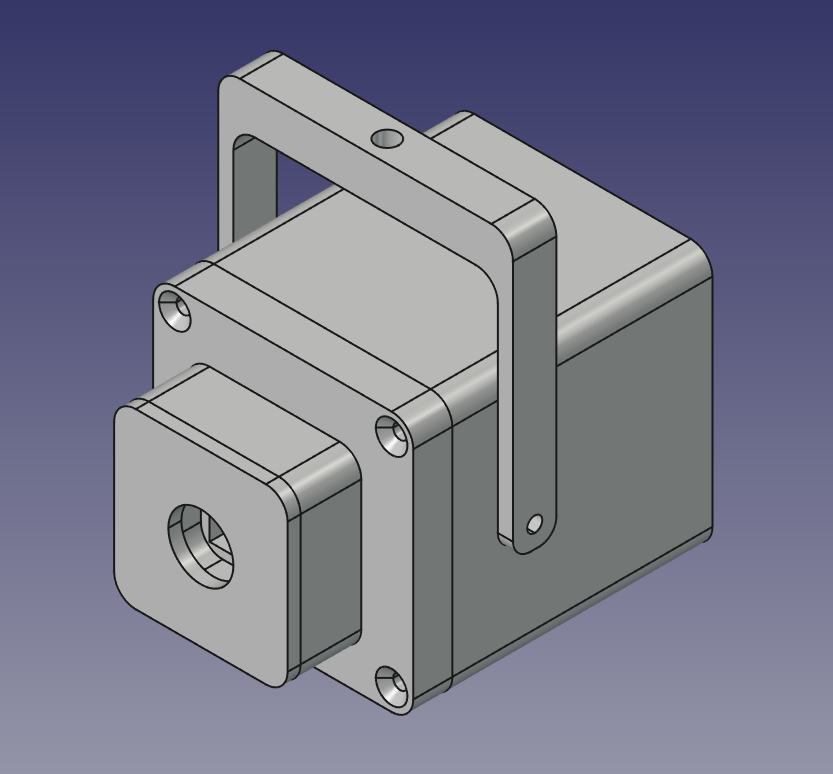

# Hardware Setup & Wiring Guide

This document describes the wiring of the MoCapSTR hardware trigger via an XLR splitter box, based on the Arduino sync module and Innomaker OV9281 cameras.

> **3D Printing Guide:** All 3D printable files (`.stl`), CAD sources (`.FCStd`), parts catalog, and print instructions are located in the [3Dprint Guide](3Dprint/README.md).

## The Concept: XLR Splitter

Instead of running long wires directly from the Arduino to each individual camera, the 5V square wave trigger signal from the Arduino is sent through a single XLR microphone cable to a central splitter box on set. From this box, the final cables branch out to the 4 cameras.

Since the trigger signal is unbalanced (consisting only of signal and ground), we adapt the 3-pin XLR pinout accordingly.

---

## Hardware Bill of Materials (BOM) - V1 Prototype

To build the complete hardware system (V1), you will need the following standard components in addition to the [3D printed parts](3Dprint/README.md). Exact model names or manufacturers for screws and buttons are not strictly required as long as the dimensions fit.

**3D Printed Enclosures:**
- **1x Arduino Trigger Case:** ([`Trigger_Case-BASE.stl`](3Dprint/v1_prototype/Trigger_Case-BASE.stl), [`Trigger_Case-LID.stl`](3Dprint/v1_prototype/Trigger_Case-LID.stl))
- **1x XLR Splitter Box:** ([`Splitter_Case-BASE.stl`](3Dprint/v1_prototype/Splitter_Case-BASE.stl), [`Splitter_Case-LID.stl`](3Dprint/v1_prototype/Splitter_Case-LID.stl))
- **4x Camera Enclosures:** ([Front](3Dprint/v1_prototype/OV9281_Case_Cam-FRONT.stl), [Mid](3Dprint/v1_prototype/OV9281_Case_Cam-MID.stl), [Back Short](3Dprint/v1_prototype/OV9281_Case_Cam-BACK-SHORT.stl) or [Back Long](3Dprint/v1_prototype/OV9281_Case_Cam-BACK-LONG.stl), and [Tripod Bracket](3Dprint/v1_prototype/OV9281_Case_Cam-BRACKET.stl))

**Electronics:**
- 1x Arduino (e.g., Nano) including a Terminal Block Shield for easy, solderless wiring inside the enclosure.
- 1x Neutrik XLR Chassis Connector (Male, D-Series dimensions) for the Arduino box.
- 1x Neutrik XLR Chassis Connector (Female, D-Series dimensions) for the splitter box.
- 1x Push-Button (Normally Open / NO) for the Arduino box lid (12mm mounting hole).
- 1x DC Barrel Jack for optional external power supply on the Arduino box (8mm mounting hole, standard 5.5x2.1mm plug).
- 4x DC Barrel Jacks for the splitter box outputs (8mm mounting holes) or direct cable feed-through.
- *(Optional for Back Long)* 4x Speaker Spring Terminals (2-pin push clips) for easy solderless cable clamping on the cameras.

**Mechanics & Assembly:**
- M3 Screws (10mm length).
- M3 Threaded Inserts (brass heat-set inserts melted into the 3D print using a soldering iron, or use direct self-tapping screws).
- 1/4"-20 UNC Hand Tap (to cut standard tripod threads into the camera brackets).

---

## 1. Arduino Enclosure (Transmitter)

  

The Arduino enclosure houses a push-button on the top lid and a male XLR connector in the base.

### Push-Button (Remote Control)
The button is mounted on the top lid and utilizes the Arduino's internal `INPUT_PULLUP` function.
- **Start/Stop Record Button:** Connects Arduino **Pin 4** to Arduino **GND**.
*(This button sends a command to the software. The cameras receive the hardware trigger continuously as long as the system is initialized.)*

### XLR Connector (Output to Splitter Box)
- **XLR Pin 1 (Ground/Shield):** Connect to Arduino **GND**.
- **XLR Pin 2 (Signal Hot):** Connect to Arduino **Pin 2**.
- **XLR Pin 3 (Signal Cold):** Bridge with XLR Pin 1 (Ground).

---

## 2. The Splitter Box (Distributor)

  

The splitter box features a female XLR input and distributes the signal to 4 cable strands leading to the cameras via DC barrel jacks (or direct cable outlets).

### Internal Wiring (Inside the Box):
1. **The Signal (Hot):** The incoming signal from **XLR Pin 2** is split and connected to the **four red wires / center pins** of the camera outlets.
2. **The Ground (GND):** The incoming ground from **XLR Pin 1** is split and connected to the **four white/black wires / outer sleeves** of the camera outlets.
3. **The Shielding of the 4 Cables:** The braided shielding of the four outgoing camera cables is bundled together and connected to **XLR Pin 1 (Ground)** as well.

*(Pin 3 of the XLR input connector can simply be bridged with Pin 1 or left empty).*

---

## 3. Connecting to the Cameras (Innomaker)

  

The four cables from the splitter box are now connected to the cameras. We use single-ended shield grounding to avoid ground loops!

- **Red Wire (Signal):** Connect to the **FSIN +** pin of the camera (or the positive spring terminal on `Cam-BACK-LONG`).
- **White/Black Wire (Ground):** Connect to the **FSIN -** pin of the camera (or the negative spring terminal on `Cam-BACK-LONG`).
- **Shielding (Braid):** Cut flush and insulate thoroughly! The shielding must **NOT** be connected to the camera or touch any metal parts on the camera side.

*Reason:* The shielding acts as a Faraday cage, catching electromagnetic interference along the cable run and safely draining it via the splitter box and XLR cable into the Arduino's ground. If connected on both ends, stray currents could flow through the cable.

---

## Cable Recommendation
A 2-core shielded audio cable (e.g., `2x 0.08 mm²` or DMX control cable) is ideal for the run from the splitter box to the cameras. For the connection between the Arduino enclosure and the splitter box, any standard XLR microphone cable will work.

---
---

# Deutsche Version

Dieses Dokument beschreibt die Verkabelung des MoCapSTR Hardware-Triggers über eine XLR-Splitter-Box, basierend auf dem Arduino-Sync-Modul und Innomaker OV9281 Kameras.

> **3D-Druck-Anleitung:** Alle 3D-Druckdateien (`.stl`), CAD-Projekte (`.FCStd`), der Teilekatalog sowie Druckhinweise befinden sich im [3D-Druck-Guide](3Dprint/README.md).

## Das Prinzip: XLR-Splitter

Anstatt lange Kabel direkt vom Arduino zu jeder Kamera zu ziehen, wird das 5V-Rechtecksignal des Arduinos über ein XLR-Mikrofonkabel zu einer zentralen Splitter-Box am Set geführt. Von dieser Box gehen dann die Endkabel zu den 4 Kameras. 

Da das Trigger-Signal asymmetrisch ("unbalanced") ist (bestehend aus Signal und Masse), passen wir die 3-polige XLR-Belegung entsprechend an.

---

## Hardware Komponentenliste (BOM) - V1 Prototype

Für den Nachbau des Gesamtsystems (V1) werden neben den [3D-Druckteilen](3Dprint/README.md) folgende Standard-Bauteile benötigt. Genaue Modellbezeichnungen oder Hersteller sind bei Schrauben und Tastern nicht zwingend erforderlich, solange die Maße passen.

**3D-Druck-Gehäuse:**
- **1x Arduino Trigger-Gehäuse:** ([`Trigger_Case-BASE.stl`](3Dprint/v1_prototype/Trigger_Case-BASE.stl), [`Trigger_Case-LID.stl`](3Dprint/v1_prototype/Trigger_Case-LID.stl))
- **1x XLR Splitter-Box:** ([`Splitter_Case-BASE.stl`](3Dprint/v1_prototype/Splitter_Case-BASE.stl), [`Splitter_Case-LID.stl`](3Dprint/v1_prototype/Splitter_Case-LID.stl))
- **4x Kamera-Gehäuse:** ([Front](3Dprint/v1_prototype/OV9281_Case_Cam-FRONT.stl), [Mittelteil](3Dprint/v1_prototype/OV9281_Case_Cam-MID.stl), [Rückteil Kurz](3Dprint/v1_prototype/OV9281_Case_Cam-BACK-SHORT.stl) oder [Rückteil Lang](3Dprint/v1_prototype/OV9281_Case_Cam-BACK-LONG.stl) sowie [Stativbügel](3Dprint/v1_prototype/OV9281_Case_Cam-BRACKET.stl))

**Elektronik:**
- 1x Arduino (z.B. Nano) inkl. einem Schraubklemmen-Erweiterungsboard (Terminal Block Shield) für einfache, lötfreie Verkabelung im Gehäuse.
- 1x Neutrik XLR Einbaubuchse (Männlich, D-Serie Maß) für das Arduino-Gehäuse.
- 1x Neutrik XLR Einbaubuchse (Weiblich, D-Serie Maß) für die Splitter-Box.
- 1x Push-Button (Drucktaster, Schließer) für den Gehäusedeckel (12mm Einbaudurchmesser).
- 1x Hohlstecker-Buchse (DC Barrel Jack) zur optionalen Stromversorgung am Arduino (8mm Einbaudurchmesser, Standard 5.5x2.1mm).
- 4x Hohlstecker-Buchsen für die Splitter-Box Ausgänge (8mm Einbaudurchmesser) oder direkte Kabelauslässe.
- *(Optional bei Rückteil Lang)* 4x Lautsprecher-Klemmenterminals (2-polige Federklemmen) zum werkzeuglosen Einklemmen der Trigger-Kabel am Kameragehäuse.

**Mechanik & Montage:**
- M3 Schrauben (10mm Länge).
- M3 Gewindeeinsätze (Threaded Inserts / Einschmelzgewinde), die mit dem Lötkolben in den 3D-Druck eingeschmolzen werden (oder alternativ Direktverschraubung).
- 1/4"-20 UNC Gewindeschneider (um Standard-Stativgewinde in die Kamerabügel zu schneiden).

---

## 1. Arduino Gehäuse (Sender)

  

Am Gehäuse des Arduinos werden ein Taster im Deckel und eine XLR-Buchse (Männlich) im Unterteil verbaut.

### Taster (Fernbedienung)
Der Taster sitzt im Deckel und nutzt die interne `INPUT_PULLUP` Funktion des Arduinos.
- **Start/Stop Record Button:** Verbindet Arduino **Pin 4** mit Arduino **GND**.
*(Dieser Taster sendet einen Befehl an die Software. Die Kameras erhalten dauerhaft das Trigger-Signal, wenn der Modus aktiv ist.)*

### XLR-Buchse (Ausgang zur Splitter-Box)
- **XLR Pin 1 (Masse/Schirm):** Mit Arduino **GND** verbinden.
- **XLR Pin 2 (Signal Hot):** Mit Arduino **Pin 2**.
- **XLR Pin 3 (Signal Cold):** Brücken mit XLR Pin 1 (Masse).

---

## 2. Die Splitter-Box (Verteiler)

  

Die Splitter-Box hat einen XLR-Eingang (Weiblich) und gibt das Signal über 4 DC-Hohlbuchsen (oder direkte Auslässe) an die 4 Kamerakabelstränge weiter.

### Interne Verdrahtung in der Box:
1. **Das Signal (Hot):** Das ankommende Signal von **XLR Pin 2** wird aufgesplittet und an die **vier roten Adern / Mittelkontakte** der Ausgänge angelötet. 
2. **Die Masse (GND):** Die ankommende Masse von **XLR Pin 1** wird aufgesplittet und an die **vier weißen/schwarzen Adern / Außenkontakte** der Ausgänge angelötet.
3. **Die Schirmung der 4 Kabel:** Die Schirmung (das Drahtgeflecht) der vier abgehenden Kamerakabel wird ebenfalls komplett zusammengeführt und an **XLR Pin 1 (Ground)** angelötet.

*(Pin 3 der XLR-Eingangsbuchse kann hier einfach mit Pin 1 gebrückt werden oder leer bleiben).*

---

## 3. Anschluss an die Kameras (Innomaker)

  

Die vier Kabel kommen nun von der Splitter-Box an den Kameras an. Wir nutzen die einseitige Schirmerdung, um Brummschleifen (Ground Loops) zu vermeiden!

- **Rote Ader (Signal):** Anschließen an den **FSIN +** Pin der Kamera (bzw. an das Plus-Terminal bei `Cam-BACK-LONG`).
- **Weiße/Schwarze Ader (Masse):** Anschließen an den **FSIN -** Pin der Kamera (bzw. an das Minus-Terminal bei `Cam-BACK-LONG`).
- **Schirmung (Drahtgeflecht):** Bündig abschneiden und gut isolieren! Die Schirmung darf an der Kamera **NICHT** angeschlossen werden oder Metall berühren. 

*Grund:* Die Schirmung fängt elektromagnetische Störungen auf der gesamten Strecke auf und leitet sie über die Splitter-Box und das XLR-Kabel sicher in den Ground des Arduinos ab (Faradayscher Käfig). Wäre sie auf beiden Seiten angeschlossen, könnten Störströme durch das Kabel fließen.

---

## Kabel-Empfehlung
Ein 2-adriges, geschirmtes Audiokabel (z.B. `2x 0.08 mm²` oder DMX-Steuerkabel) ist ideal für die Strecke von der Splitter-Box zu den Kameras. Für die Strecke zwischen Arduino und Box reicht jedes handelsübliche XLR-Mikrofonkabel.
