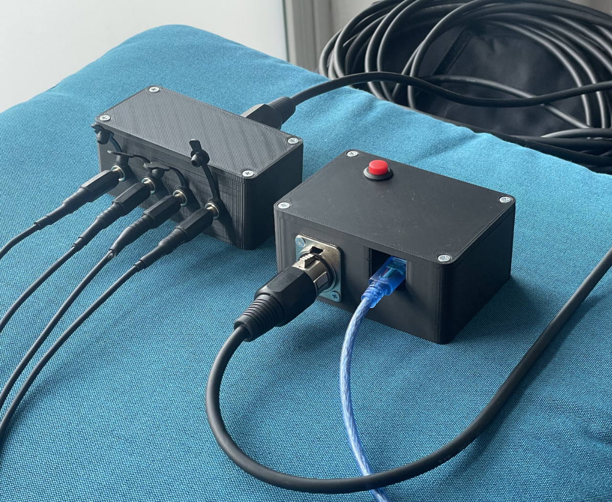
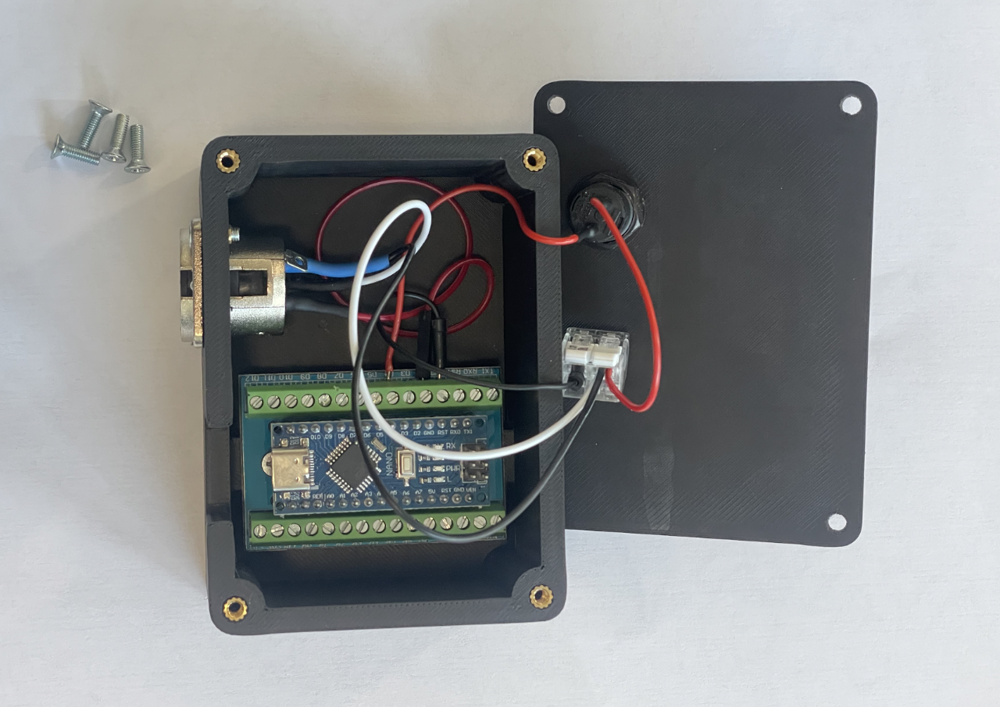
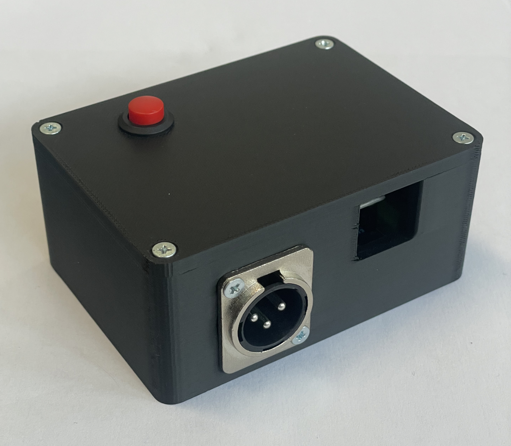
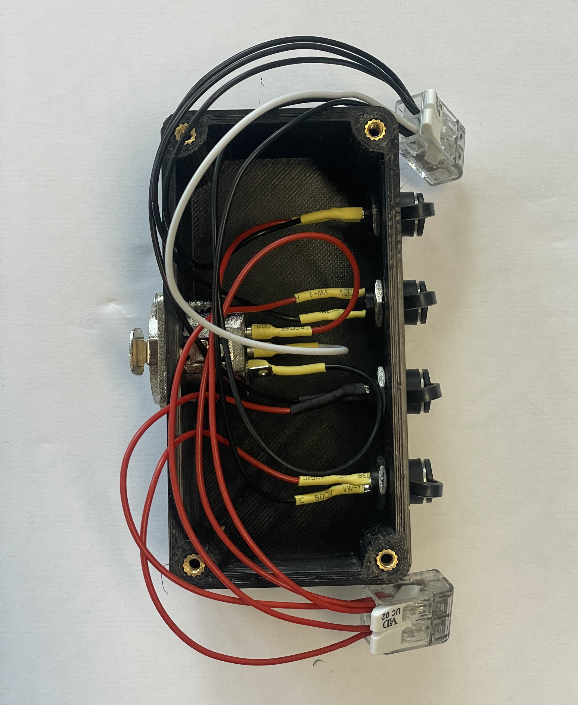
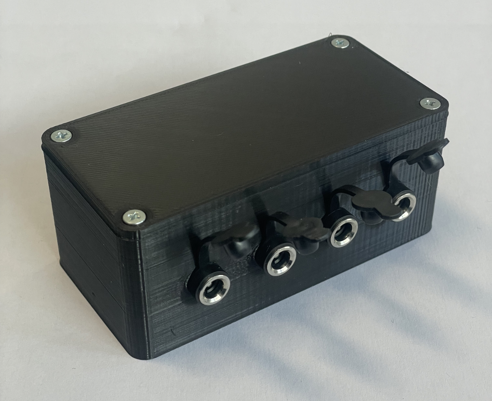
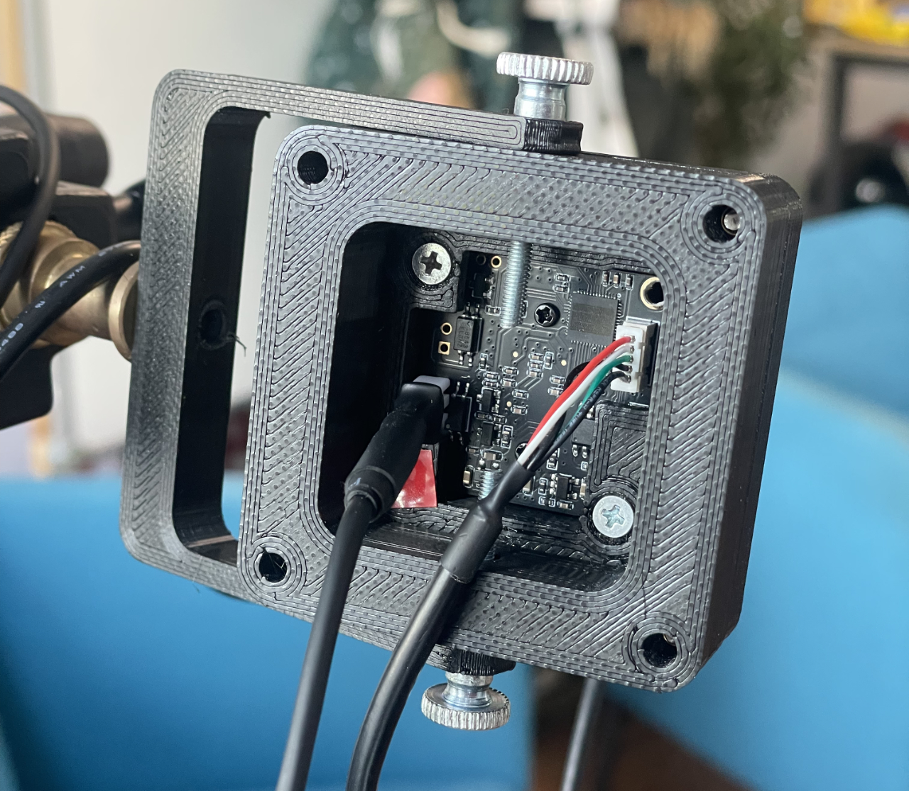
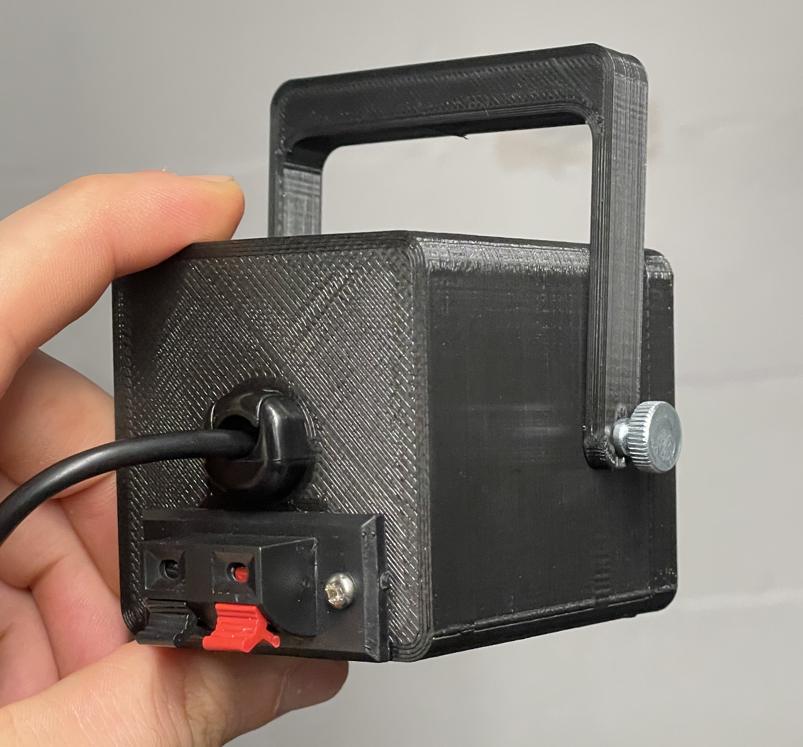

# Hardware Setup & Wiring Guide

This document describes the wiring of the MoCapSTR hardware trigger via an XLR splitter box, based on the Arduino sync module and Innomaker OV9281 cameras.

> **3D Printing & Assembly Guide:** Complete CAD source files (`.FCStd`), 3D printable files (`.stl`), and a full step-by-step photo assembly guide are in the [3Dprint & Assembly Guide](3Dprint/README.md).

## The Concept: XLR Splitter

Instead of running long wires directly from the Arduino to each individual camera, the 5V square wave trigger signal from the Arduino is sent through a single XLR microphone cable to a central splitter box on set. From this box, the final cables branch out to the 4 cameras.

  
   
  <em>Arduino Trigger Box (right, with blue USB cable to PC) connected via standard XLR cable to the Splitter Box (left, distributing to 4 camera DC cables).</em>

Since the trigger signal is unbalanced (consisting only of signal and ground), we adapt the 3-pin XLR pinout accordingly.

---

## Hardware Bill of Materials (BOM) - V1 Prototype

To build the complete hardware system (V1), you will need the following standard components in addition to the [3D printed parts](3Dprint/README.md):

**3D Printed Enclosures:**
- **1x Arduino Trigger Case:** ([`Trigger_Case-BASE.stl`](3Dprint/v1_prototype/Trigger_Case-BASE.stl), [`Trigger_Case-LID.stl`](3Dprint/v1_prototype/Trigger_Case-LID.stl))
- **1x XLR Splitter Box:** ([`Splitter_Case-BASE.stl`](3Dprint/v1_prototype/Splitter_Case-BASE.stl), [`Splitter_Case-LID.stl`](3Dprint/v1_prototype/Splitter_Case-LID.stl))
- **4x Camera Enclosures:** ([Front](3Dprint/v1_prototype/OV9281_Case_Cam-FRONT.stl), [Mid](3Dprint/v1_prototype/OV9281_Case_Cam-MID.stl), [Back Short](3Dprint/v1_prototype/OV9281_Case_Cam-BACK-SHORT.stl) or [Back Long](3Dprint/v1_prototype/OV9281_Case_Cam-BACK-LONG.stl), and [Tripod Bracket](3Dprint/v1_prototype/OV9281_Case_Cam-BRACKET.stl))

**Electronics & Cables:**
- 1x Arduino (e.g., Nano) with Terminal Block Shield adapter board for solderless wiring.
- 1x Neutrik XLR Chassis Connector (Male, D-Series dimensions) for the Arduino box.
- 1x Neutrik XLR Chassis Connector (Female, D-Series dimensions) for the splitter box.
- 1x Push-Button (Normally Open / NO) for the Arduino box lid (12mm mounting hole).
- 1x DC Barrel Jack for optional external power supply on the Arduino box (8mm mounting hole, standard 5.5x2.1mm).
- 4x DC Barrel Jacks for the splitter box outputs (8mm mounting holes).
- 2x 5-pin Cage Clamp Terminals (WAGO 221 or similar) to bundle splitter box connections.
- 4x Innomaker OV9281 USB global-shutter camera modules.
- 4x 2-Pin Micro Plugs (e.g. JST 1.25mm 2-pin) to plug trigger lines cleanly onto the camera board's FSIN pins.
- **Recommended Host PC USB PCIe Card (for 4+ Cameras):** **StarTech 4-Port USB 3.0 PCIe Card (Model: `P5Q4A-USB-CARD`)** — features 4 independent controller channels (1 dedicated host controller chip per port), completely eliminating motherboard USB bandwidth saturation and packet collisions.

**Mechanics & Fasteners:**
- **Trigger Box:** 8x M3 10mm screws, 8x M3 brass heat-set inserts.
- **Splitter Box:** 6x M3 10mm screws, 6x M3 brass heat-set inserts.
- **Per Camera:** 7x M3 15mm screws, 2x M3 thumbscrews (10–25mm), 9x M3 brass heat-set inserts.
- 1/4"-20 UNC Hand Tap (to cut standard tripod threads into the camera brackets).

---

## 1. Arduino Enclosure (Transmitter)

  
  &nbsp;&nbsp;&nbsp;&nbsp;
  

The Arduino enclosure houses a push-button in the top lid and a male XLR connector in the base.

### Push-Button (Remote Control)
The button is mounted on the top lid and utilizes the Arduino's internal `INPUT_PULLUP` function.
- **Start/Stop Record Button:** Connects Arduino **Pin 4** to Arduino **GND**.
*(This button sends a command to the software. The cameras receive the hardware trigger continuously as long as the system is initialized.)*

### XLR Connector (Output to Splitter Box)
- **XLR Pin 1 (Ground/Shield):** Connect to Arduino **GND**.
- **XLR Pin 2 (Signal Hot):** Connect to Arduino **Pin 2**.
- **XLR Pin 3 (Signal Cold):** Bridge with XLR Pin 1 (Ground).

---

## 2. The Splitter Box (Distributor)

  
  &nbsp;&nbsp;&nbsp;&nbsp;
  

The splitter box features a female XLR input and distributes the signal to 4 cable strands leading to the cameras via DC barrel jacks.

### Internal Wiring (Inside the Box):
1. **The Signal (Hot):** The incoming signal from **XLR Pin 2** goes into the first 5-pin cage clamp terminal and connects to the **four positive / center pins** of the DC jacks.
2. **The Ground (GND):** The incoming ground from **XLR Pin 1** goes into the second 5-pin cage clamp terminal and connects to the **four negative / outer sleeves** of the DC jacks.
3. **The Shielding of the Cables:** The braided shielding is connected to **XLR Pin 1 (Ground)** as well.

*(Pin 3 of the XLR input connector can simply be bridged with Pin 1 or left empty).*

---

## 3. Connecting to the Cameras (Innomaker)

  
  &nbsp;&nbsp;&nbsp;&nbsp;
  

The four cables from the splitter box are connected to the cameras. We use single-ended shield grounding to avoid ground loops!

- **Red Wire (Signal):** Connect to the **FSIN +** pin of the camera (or to the red spring terminal clip on `Cam-BACK-LONG`).
- **White/Black Wire (Ground):** Connect to the **FSIN -** pin of the camera (or to the black spring terminal clip on `Cam-BACK-LONG`).
- **Connector Tip:** Standard **2-pin micro connectors (e.g., JST 1.25mm 2-pin)** fit directly onto the camera PCB's FSIN pins for a secure, detachable connection.
- **Shielding (Braid):** Cut flush and insulate thoroughly! The shielding must **NOT** be connected to the camera or touch any metal parts on the camera side.

*Reason:* The shielding acts as a Faraday cage, catching electromagnetic interference along the cable run and safely draining it via the splitter box and XLR cable into the Arduino's ground. If connected on both ends, stray currents could flow through the cable.

> [!TIP]
> **Modular 90° Orientation (Portrait vs. Landscape):**
> Thanks to the symmetrical square 4-screw layout between `Cam-MID` and the back cover, you can easily change the camera from Landscape (horizontal) to Portrait (vertical) orientation. Simply loosen the 4 corner screws on the back cover, rotate the back cover 90°, and screw it back down. This allows you to orient the cameras vertically to maximize vertical capture resolution for standing actors.

---

## Cable & USB Recommendations

- **Trigger Cable (Splitter to Cameras):** A 2-core shielded audio cable (e.g., `2x 0.08 mm²` or DMX control cable) is ideal for the run from the splitter box to the cameras.
- **XLR Cable (Arduino to Splitter):** Standard 3-pin XLR microphone cable.
- **Host PC USB Expansion Card:** **StarTech `P5Q4A-USB-CARD` (4-Port PCIe)** — Verified for 4-camera hardware-sync capture without bandwidth bottlenecks.

---

## Troubleshooting & Hardware Diagnostics

### Camera is Frozen on a Single Frame (`0.0 FPS` / `⚠️ NO SIGNAL / FROZEN`)
If a camera opens during initialization with a single initial frame but remains frozen at `0.0 FPS` while the other cameras stream smoothly at 25/30 FPS:
1. **Free-Run Test:** In the MoCapSTR software (Setup tab), uncheck `[ ] Enable UVC Hardware Trigger` and initialize. If all cameras stream live in Free-Run, your USB card, cable, and driver are fine — the fault is **100% in the physical trigger connection**.
2. **Check Splitter Box Terminals:** Open the splitter box and check whether the WAGO cage clamp terminal or DC connector wire for that specific camera is loose or disconnected.
3. **Verify `FSIN+` / `FSIN-` Polarity:** The camera input diode requires correct polarity (Red = `FSIN+`, Black = `FSIN-` / Ground). If reversed, trigger pulses cannot trigger the sensor.
4. **Cross-Test Ports:** Swap the DC barrel jack of the faulty camera with a working camera at the splitter box to quickly isolate whether the cable or splitter output is broken.

---
---

# Deutsche Version

Dieses Dokument beschreibt die Verkabelung des MoCapSTR Hardware-Triggers über eine XLR-Splitter-Box, basierend auf dem Arduino-Sync-Modul und Innomaker OV9281 Kameras.

> **3D-Druck & Montageanleitung:** Vollständige CAD-Quelldateien (`.FCStd`), druckbare Dateien (`.stl`) sowie eine bebilderte Schritt-für-Schritt-Montageanleitung befinden sich im [3D-Druck- & Montage-Guide](3Dprint/README.md).

## Das Prinzip: XLR-Splitter

Anstatt lange Kabel direkt vom Arduino zu jeder Kamera zu ziehen, wird das 5V-Rechtecksignal des Arduinos über ein XLR-Mikrofonkabel zu einer zentralen Splitter-Box am Set geführt. Von dieser Box gehen dann die Endkabel zu den 4 Kameras. 

  
   
  <em>Arduino Trigger-Gehäuse über handelsübliches XLR-Kabel mit der Splitter-Box verbunden, von der 4 DC-Kabel zu den Kameras abzweigen.</em>

Da das Trigger-Signal asymmetrisch ("unbalanced") ist (bestehend aus Signal und Masse), passen wir die 3-polige XLR-Belegung entsprechend an.

---

## Hardware Komponentenliste (BOM) - V1 Prototype

Für den Nachbau des Gesamtsystems (V1) werden neben den [3D-Druckteilen](3Dprint/README.md) folgende Standard-Bauteile benötigt:

**3D-Druck-Gehäuse:**
- **1x Arduino Trigger-Gehäuse:** ([`Trigger_Case-BASE.stl`](3Dprint/v1_prototype/Trigger_Case-BASE.stl), [`Trigger_Case-LID.stl`](3Dprint/v1_prototype/Trigger_Case-LID.stl))
- **1x XLR Splitter-Box:** ([`Splitter_Case-BASE.stl`](3Dprint/v1_prototype/Splitter_Case-BASE.stl), [`Splitter_Case-LID.stl`](3Dprint/v1_prototype/Splitter_Case-LID.stl))
- **4x Kamera-Gehäuse:** ([Front](3Dprint/v1_prototype/OV9281_Case_Cam-FRONT.stl), [Mittelteil](3Dprint/v1_prototype/OV9281_Case_Cam-MID.stl), [Rückteil Kurz](3Dprint/v1_prototype/OV9281_Case_Cam-BACK-SHORT.stl) oder [Rückteil Lang](3Dprint/v1_prototype/OV9281_Case_Cam-BACK-LONG.stl) sowie [Stativbügel](3Dprint/v1_prototype/OV9281_Case_Cam-BRACKET.stl))

**Elektronik & Kabel:**
- 1x Arduino (z.B. Nano) inkl. Schraubklemmen-Shield (Terminal Block Shield) für einfache, lötfreie Verkabelung.
- 1x Neutrik XLR Einbaubuchse (Männlich, D-Serie Maß) für das Arduino-Gehäuse.
- 1x Neutrik XLR Einbaubuchse (Weiblich, D-Serie Maß) für die Splitter-Box.
- 1x Push-Button (Drucktaster, Schließer) für den Gehäusedeckel (12mm Einbaudurchmesser).
- 1x Hohlstecker-Buchse (DC Barrel Jack) zur optionalen Stromversorgung am Arduino (8mm Einbaudurchmesser, Standard 5.5x2.1mm).
- 4x Hohlstecker-Buchsen für die Splitter-Box Ausgänge (8mm Einbaudurchmesser).
- 2x 5-polige Käfigzugklemmen (z. B. WAGO 221) zum Zusammenführen der Signal- und Masseleitungen in der Splitter-Box.
- 4x Innomaker OV9281 USB Global-Shutter Kameramodule.
- 4x 2-Pin Mikro-Steckverbinder (z. B. JST 1.25mm 2-Pin), um die Triggerkabel direkt und steckbar auf die FSIN-Pins der Kameraplatinen zu stecken.
- **Empfohlene Host-PC USB-PCIe-Erweiterungskarte (für 4+ Kameras):** **StarTech 4-Port USB 3.0 PCIe-Karte (Modell: `P5Q4A-USB-CARD`)** — verfügt über 4 getrennte Controller-Kanäle (1 dedizierter Controller-Chip pro Port), wodurch Bandbreiten-Engpässe und Paketkollisionen vollständig vermieden werden.

**Mechanik & Schrauben:**
- **Trigger-Box:** 8x M3 10mm Schrauben, 8x M3 Einschmelzgewinde.
- **Splitter-Box:** 6x M3 10mm Schrauben, 6x M3 Einschmelzgewinde.
- **Pro Kamera:** 7x M3 15mm Schrauben, 2x M3 Rändelschrauben (10–25mm), 9x M3 Einschmelzgewinde.
- 1/4"-20 UNC Gewindeschneider (um Standard-Stativgewinde in die Kamerabügel zu schneiden).

---

## 1. Arduino Gehäuse (Sender)

  
  &nbsp;&nbsp;&nbsp;&nbsp;
  

Am Gehäuse des Arduinos werden ein Taster im Deckel und eine XLR-Buchse (Männlich) im Unterteil verbaut.

### Taster (Fernbedienung)
Der Taster sitzt im Deckel und nutzt die interne `INPUT_PULLUP` Funktion des Arduinos.
- **Start/Stop Record Button:** Verbindet Arduino **Pin 4** mit Arduino **GND**.
*(Dieser Taster sendet einen Befehl an die Software. Die Kameras erhalten dauerhaft das Trigger-Signal, wenn der Modus aktiv ist.)*

### XLR-Buchse (Ausgang zur Splitter-Box)
- **XLR Pin 1 (Masse/Schirm):** Mit Arduino **GND** verbinden.
- **XLR Pin 2 (Signal Hot):** Mit Arduino **Pin 2**.
- **XLR Pin 3 (Signal Cold):** Brücken mit XLR Pin 1 (Masse).

---

## 2. Die Splitter-Box (Verteiler)

  
  &nbsp;&nbsp;&nbsp;&nbsp;
  

Die Splitter-Box hat einen XLR-Eingang (Weiblich) und gibt das Signal über 4 DC-Hohlbuchsen an die 4 Kamerakabel weiter.

### Interne Verdrahtung in der Box:
1. **Das Signal (Hot):** Das ankommende Signal von **XLR Pin 2** wird über eine 5er-Käfigzugklemme auf die **vier roten Adern / Mittelkontakte** der DC-Buchsen verteilt. 
2. **Die Masse (GND):** Die ankommende Masse von **XLR Pin 1** wird über eine zweite 5er-Käfigzugklemme auf die **vier schwarzen Adern / Außenkontakte** der DC-Buchsen verteilt.
3. **Die Schirmung der Kabel:** Das Drahtgeflecht wird ebenfalls an **XLR Pin 1 (Ground)** angeschlossen.

*(Pin 3 der XLR-Eingangsbuchse kann hier einfach mit Pin 1 gebrückt werden oder leer bleiben).*

---

## 3. Anschluss an die Kameras (Innomaker)

  
  &nbsp;&nbsp;&nbsp;&nbsp;
  

Die vier Kabel kommen von der Splitter-Box an den Kameras an. Wir nutzen die einseitige Schirmerdung, um Brummschleifen (Ground Loops) zu vermeiden!

- **Rote Ader (Signal):** Anschließen an den **FSIN +** Pin der Kamera (bzw. an das rote Klemmterminal bei `Cam-BACK-LONG`).
- **Weiße/Schwarze Ader (Masse):** Anschließen an den **FSIN -** Pin der Kamera (bzw. an das schwarze Klemmterminal bei `Cam-BACK-LONG`).
- **Stecker-Tipp:** Kleine **2-Pin-Steckverbinder (z. B. JST 1.25mm 2-Pin)** passen perfekt auf die beiden FSIN-Stifte der Platine für eine saubere, steckbare Verbindung.
- **Schirmung (Drahtgeflecht):** Bündig abschneiden und gut isolieren! Die Schirmung darf an der Kamera **NICHT** angeschlossen werden oder Metall berühren. 

*Grund:* Die Schirmung fängt elektromagnetische Störungen auf der gesamten Strecke auf und leitet sie über die Splitter-Box und das XLR-Kabel sicher in den Ground des Arduinos ab (Faradayscher Käfig). Wäre sie auf beiden Seiten angeschlossen, könnten Störströme durch das Kabel fließen.

> [!TIP]
> **Modulare 90°-Drehung (Hochkant vs. Querformat):**
> Dank des quadratischen 4-Schrauben-Lochmusters zwischen `Cam-MID` und dem Rückteil kannst du entscheiden, ob die Kamera horizontal (Querformat) oder vertikal (Hochkant / 90° gedreht) am Stativbügel montiert sein soll. Einfach die 4 Schrauben des Rückteils lösen, das Rückteil um 90° drehen und wieder festschrauben. So lässt sich das Bild optimal an stehende Darsteller anpassen.

---

## Kabel- & USB-Empfehlungen

- **Trigger-Kabel (Splitter zu Kameras):** Ein 2-adriges, geschirmtes Audiokabel (z. B. `2x 0.08 mm²` oder DMX-Steuerkabel) ist ideal für die Strecke von der Splitter-Box zu den Kameras.
- **XLR-Kabel (Arduino zu Splitter):** Jedes handelsübliche 3-polige XLR-Mikrofonkabel.
- **USB-PCIe-Erweiterungskarte:** **StarTech `P5Q4A-USB-CARD` (4-Port PCIe)** — Getestet und verifiziert für den synchronen Betrieb von 4 InnoMaker OV9281 Kameras. Verhindert Bandbreiten-Staus zuverlässig durch 4 separate Controller-Chips.

---

## Fehlerbehebung & Hardware-Diagnose (Troubleshooting)

### Kamera zeigt ein Standbild bei `0.0 FPS` (`⚠️ NO SIGNAL / FROZEN`)
Wenn eine Kamera beim Initialisieren ein einziges Standbild liefert, danach aber mit `0.0 FPS` und rotem Warn-Overlay einfriert (während die anderen Kameras flüssig laufen):
1. **Free-Run-Gegenprobe:** Deaktiviere in MoCapSTR (Setup-Tab) das Häkchen `[ ] Enable UVC Hardware Trigger` und klicke auf Initialisieren. Wenn die Kamera im Free-Run flüssig läuft, sind USB-Karte, Kabel und Treiber zu 100 % in Ordnung – der Fehler liegt **ausschließlich an der physischen Trigger-Leitung**.
2. **Klemmen in der Splitter-Box prüfen:** Öffne die Splitter-Box und prüfe, ob die WAGO-Klemme oder die Lötverbindung zur DC-Buchse der betroffenen Kamera lose ist oder herausgerutscht ist.
3. **Polarität an der Kamera prüfen (`FSIN+` / `FSIN-`):** Die Eingangsschutzdiode des OV9281-Moduls erfordert zwingend die korrekte Polarität (Rot = `FSIN+`, Schwarz = `FSIN-` / Masse). Bei vertauschten Adern blockiert die Diode und der Sensor erhält keine Pulse.
4. **Kreuztest an der Splitter-Box:** Stecke den DC-Hohlstecker der betroffenen Kamera an der Splitter-Box in einen funktionierenden Ausgang um, um sofort zu sehen, ob das Kabel oder die Splitter-Buchse die Ursache ist.
